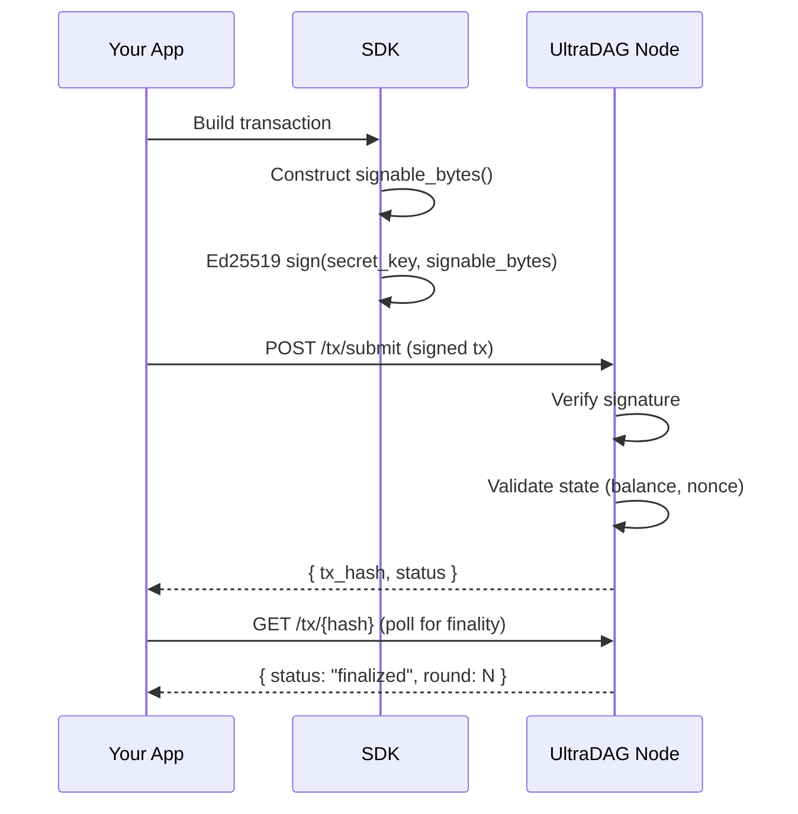

# SDKs

UltraDAG provides 4 official SDKs for interacting with the network. All SDKs support local Ed25519 key generation, Blake3 address derivation, client-side transaction signing, and all RPC endpoints.

---

## Overview

| SDK | Language | Install | Tests |
|-----|----------|---------|-------|
| Python | Python 3.8+ | `pip install ultradag` | 41 |
| JavaScript | Node.js / Browser | `npm install @ultradag/sdk` | 55 |
| Rust | Rust 1.70+ | `cargo add ultradag-sdk` | 14 |
| Go | Go 1.21+ | `go get github.com/ultradag/sdk-go/ultradag` | 36 |

### SDK Features (All Languages)

All 4 SDKs provide:

- **Local Ed25519 keypair generation** (no RPC needed)
- **Blake3 address derivation** from public key
- **Client-side transaction signing** for all 8 transaction types
- **Complete RPC wrapper** for all endpoints
- **Type-safe response structs** with error handling
- **Unit conversion** helpers (`sats_to_udag()`, `udag_to_sats()`)
- **`/tx/submit` support** for mainnet-compatible pre-signed transactions

---

## Python SDK

### Installation

```bash
pip install ultradag
```

Dependencies: `pynacl` (Ed25519), `blake3` (hashing), `requests` (HTTP).

### Quick Start

```python
from ultradag import UltraDagClient, Keypair

# Connect to a node
client = UltraDagClient("https://ultradag-node-1.fly.dev")

# Generate a local keypair
keypair = Keypair.generate()
print(f"Address: {keypair.address}")
print(f"Public key: {keypair.public_key_hex}")

# Check node status
status = client.get_status()
print(f"Round: {status.dag_round}, Finalized: {status.last_finalized_round}")

# Get faucet funds (testnet)
faucet_result = client.faucet(keypair.address, 100_00000000)  # 100 UDAG
print(f"Faucet tx: {faucet_result.tx_hash}")

# Check balance
balance = client.get_balance(keypair.address)
print(f"Balance: {balance.balance_udag} UDAG")

# Send a transfer
tx_hash = client.send_tx(
    secret_key=keypair.secret_key_hex,
    to="recipient_address_here",
    amount=50_00000000,  # 50 UDAG
    fee=10_000
)
print(f"Transfer tx: {tx_hash}")
```

### Client-Side Signing (Mainnet)

```python
from ultradag import Keypair, TransferTx

keypair = Keypair.from_secret_key("your_secret_key_hex")

# Build and sign locally
tx = TransferTx(
    from_addr=keypair.address,
    to="recipient_address",
    amount=50_00000000,
    fee=10_000,
    nonce=0,
    pub_key=keypair.public_key_hex,
)
signed = tx.sign(keypair.secret_key_bytes)

# Submit pre-signed transaction
client.submit_tx(signed)
```

### Running Tests

```bash
cd sdk/python
python -m pytest tests/ -v
```

---

## JavaScript / TypeScript SDK

### Installation

```bash
npm install @ultradag/sdk
```

Dependencies: `@noble/ed25519` (signatures), `blake3` (hashing).

### Quick Start

```javascript
import { UltraDagClient, Keypair } from '@ultradag/sdk';

// Connect to a node
const client = new UltraDagClient('https://ultradag-node-1.fly.dev');

// Generate a local keypair
const keypair = Keypair.generate();
console.log(`Address: ${keypair.address}`);

// Check node status
const status = await client.getStatus();
console.log(`Round: ${status.dagRound}, Finalized: ${status.lastFinalizedRound}`);

// Get faucet funds (testnet)
const faucet = await client.faucet(keypair.address, 10_000_000_000n);
console.log(`Faucet tx: ${faucet.txHash}`);

// Check balance
const balance = await client.getBalance(keypair.address);
console.log(`Balance: ${balance.balanceUdag} UDAG`);

// Send a transfer
const txHash = await client.sendTx(
  keypair.secretKeyHex,
  'recipient_address_here',
  5_000_000_000n,  // 50 UDAG
  10_000n
);
console.log(`Transfer tx: ${txHash}`);
```

### Client-Side Signing (Mainnet)

```javascript
import { Keypair, TransferTx } from '@ultradag/sdk';

const keypair = Keypair.fromSecretKey('your_secret_key_hex');

// Build and sign locally
const tx = new TransferTx({
  from: keypair.address,
  to: 'recipient_address',
  amount: 5_000_000_000n,
  fee: 10_000n,
  nonce: 0n,
  pubKey: keypair.publicKeyHex,
});
const signed = tx.sign(keypair.secretKeyBytes);

// Submit pre-signed transaction
await client.submitTx(signed);
```

### Running Tests

```bash
cd sdk/javascript
npm test
```

---

## Rust SDK

### Installation

Add to your `Cargo.toml`:

```toml
[dependencies]
ultradag-sdk = { path = "sdk/rust" }
```

Or from the workspace:

```bash
cargo add ultradag-sdk
```

### Quick Start

```rust
use ultradag_sdk::{Client, Keypair};

#[tokio::main]
async fn main() -> Result<(), Box<dyn std::error::Error>> {
    // Connect to a node
    let client = Client::new("https://ultradag-node-1.fly.dev");

    // Generate a local keypair
    let keypair = Keypair::generate();
    println!("Address: {}", keypair.address_hex());

    // Check node status
    let status = client.get_status().await?;
    println!("Round: {}, Finalized: {}",
        status.dag_round, status.last_finalized_round);

    // Check balance
    let balance = client.get_balance(&keypair.address_hex()).await?;
    println!("Balance: {} sats", balance.balance);

    Ok(())
}
```

### Running Tests

```bash
cargo test -p ultradag-sdk
```

---

## Go SDK

### Installation

```bash
go get github.com/ultradag/sdk-go/ultradag
```

### Quick Start

```go
package main

import (
    "fmt"
    "log"

    "github.com/ultradag/sdk-go/ultradag"
)

func main() {
    // Connect to a node
    client := ultradag.NewClient("https://ultradag-node-1.fly.dev")

    // Generate a local keypair
    keypair, err := ultradag.GenerateKeypair()
    if err != nil {
        log.Fatal(err)
    }
    fmt.Printf("Address: %s\n", keypair.Address)

    // Check node status
    status, err := client.GetStatus()
    if err != nil {
        log.Fatal(err)
    }
    fmt.Printf("Round: %d, Finalized: %d\n",
        status.DagRound, status.LastFinalizedRound)

    // Get faucet funds (testnet)
    faucet, err := client.Faucet(keypair.Address, 10_000_000_000)
    if err != nil {
        log.Fatal(err)
    }
    fmt.Printf("Faucet tx: %s\n", faucet.TxHash)

    // Check balance
    balance, err := client.GetBalance(keypair.Address)
    if err != nil {
        log.Fatal(err)
    }
    fmt.Printf("Balance: %.4f UDAG\n", balance.BalanceUDAG)

    // Send a transfer
    txHash, err := client.SendTx(
        keypair.SecretKeyHex,
        "recipient_address_here",
        5_000_000_000,  // 50 UDAG
        10_000,
    )
    if err != nil {
        log.Fatal(err)
    }
    fmt.Printf("Transfer tx: %s\n", txHash)
}
```

### Running Tests

```bash
cd sdk/go
go test ./...
```

---

## Client-Side Signing Flow

For mainnet, all transactions must be signed client-side. The flow is identical across all SDKs:



All SDKs construct `signable_bytes()` byte-identically to the Rust reference implementation, ensuring cross-language signing compatibility.

---

## Test Counts

| SDK | Unit Tests | Coverage |
|-----|-----------|----------|
| Python | 41 | All tx types, signing, RPC, address derivation |
| JavaScript | 55 | All tx types, signing, RPC, address derivation, BigInt handling |
| Rust | 14 | Wrapper around ultradag-coin types, RPC client |
| Go | 36 | All tx types, signing, RPC, address derivation |
| **Total** | **146** | |

---

## Next Steps

- [Transaction Format](transactions.md) — signing specification details
- [RPC Endpoints](rpc.md) — complete API reference
- [Quick Start](../getting-started/quickstart.md) — run your first node
