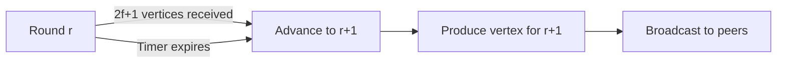
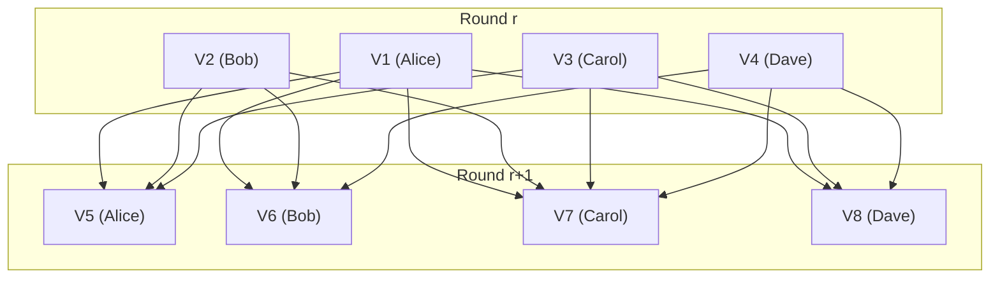

# DAG-BFT Consensus

UltraDAG uses a DAG-based Byzantine Fault Tolerant consensus protocol. This page provides a technical deep dive into vertex production, finality, ordering, and pruning.

---

## System Model

### Validators

The protocol operates with a set of up to **21 active validators**, each identified by an Ed25519 public key and weighted by effective stake. Validators produce DAG vertices containing transactions and references to parent vertices.

### BFT Fault Model

UltraDAG assumes the standard BFT fault threshold:

$$
n \geq 3f + 1
$$

Where $n$ is the total number of validators and $f$ is the maximum number of Byzantine (arbitrarily faulty) validators. With 21 validators, the protocol tolerates up to **6 Byzantine validators**.

### Partial Synchrony

The protocol operates under partial synchrony — there exists an unknown Global Stabilization Time (GST) after which all messages between honest validators are delivered within a known bound $\Delta$. Before GST, no timing guarantees are made. Safety holds regardless of timing; liveness requires eventual synchrony.

---

## DagVertex Structure

Each vertex in the DAG contains:

```rust
struct DagVertex {
    author: PublicKey,       // Ed25519 public key of the producer
    round: u64,              // Monotonically increasing round number
    parents: Vec<Hash>,      // Parent vertex hashes (up to MAX_PARENTS)
    transactions: Vec<Transaction>,  // Batch of transactions
    timestamp: u64,          // Unix timestamp (informational)
    signature: Signature,    // Ed25519 signature over content
    hash: Hash,              // Blake3(author || round || parents || txs || timestamp)
}
```

!!! note "Hash computation"
    The vertex hash is computed as `blake3(author || round || sorted_parents || transactions || timestamp)`. Parents are sorted before hashing to ensure deterministic hash computation regardless of insertion order.

---

## Round-Based Vertex Production

Vertices are produced in rounds. Each round, every active validator produces exactly one vertex.

### Round Advancement

A validator advances to round $r+1$ when **either** condition is met:

1. **Optimistic gate**: received vertices from $\geq 2f+1$ validators for round $r$
2. **Timer gate**: round timer expires (default: 5 seconds)



The optimistic gate enables **responsive finality** — when the network is healthy, rounds advance as fast as messages propagate, without waiting for the full timer. Under poor network conditions, the timer ensures progress.

### Parent Selection

When producing a vertex for round $r+1$, the validator selects parents from round $r$ vertices:

1. **Scoring**: each candidate parent is scored using `blake3(candidate_hash || author_key)`
2. **Selection**: top `K_PARENTS` (default: 32) by score, capped at `MAX_PARENTS` (64)
3. **Determinism**: the Blake3 scoring ensures all honest validators select similar parent sets

| Parameter | Value | Purpose |
|-----------|-------|---------|
| `K_PARENTS` | 32 | Target parent count |
| `MAX_PARENTS` | 64 | Hard maximum |

!!! info "Why Blake3 scoring?"
    Deterministic parent scoring ensures high overlap between validators' parent selections, which accelerates finality convergence. Random or arbitrary parent selection would lead to slower finality as each vertex would cover fewer unique ancestors.

---

## Finality

### Finality Condition

A vertex $v$ from round $r$ is **finalized** when validators holding more than 2/3 of total stake have $v$ as an ancestor. Formally:

$$
\text{finalized}(v) \iff \sum_{i : v \in \text{ancestors}(v_i)} \text{stake}_i > \frac{2}{3} \sum \text{stakes}
$$

### Implementation: BitVec Coverage

Tracking ancestry naively would require traversing the full DAG for each vertex. UltraDAG uses a `BitVec`-based optimization for O(1) amortized coverage checking:

1. Each vertex maintains a `BitVec` of length $n$ (validator count)
2. When validator $i$ produces a vertex with $v$ as an ancestor, bit $i$ is set
3. A vertex is finalized when the set bits represent >2/3 of total stake
4. BitVec inheritance: a new vertex inherits the union of its parents' BitVecs

This makes finality checking constant-time per vertex, regardless of DAG depth.

### 2-Round Finality

Under normal conditions (all validators honest and online), finality is achieved in **2 rounds**:

1. **Round $r$**: Validator $A$ produces vertex $v$
2. **Round $r+1$**: All other validators include $v$ (or a descendant) as a parent. After this round, $v$ has >2/3 coverage and is finalized.

At 5-second rounds, this yields **~10 second finality**.



After round $r+1$, all vertices from round $r$ have coverage from all 4 validators and are finalized.

---

## Deterministic Ordering

Finalized vertices must be applied to the state engine in a **deterministic order** agreed upon by all honest validators. UltraDAG uses a simple total ordering:

$$
\text{order}(v_1, v_2) = \text{compare}((v_1.\text{round}, v_1.\text{hash}), (v_2.\text{round}, v_2.\text{hash}))
$$

1. Sort by round (ascending)
2. Break ties by vertex hash (lexicographic, ascending)

This ordering is:

- **Deterministic**: depends only on vertex content, not arrival order
- **Unique**: Blake3 hashes are collision-resistant
- **Fair**: hash-based tiebreaking doesn't favor any particular validator

---

## Equivocation Detection

A validator **equivocates** if it produces two different vertices for the same round. UltraDAG detects and penalizes equivocation:

### Detection

When a node receives a vertex for round $r$ from validator $V$, and already has a different vertex from $V$ for round $r$:

1. Both vertices are retained as **equivocation evidence**
2. Evidence is gossiped to all peers
3. Once finalized, the evidence triggers deterministic slashing

### Slashing

Upon finalized equivocation evidence:

- **50% of the equivocating validator's stake is burned** (removed from total supply)
- The slash percentage is governable (range: 10-100%)
- Delegators to the slashed validator also lose proportionally
- The validator is removed from the active set

!!! danger "Slashing is deterministic"
    All honest validators independently detect and apply the same slash, producing identical state transitions. There is no voting or subjective judgment — equivocation evidence is cryptographically verifiable.

---

## Pruning

To keep storage bounded, UltraDAG prunes old DAG vertices:

### Pruning Horizon

| Parameter | Value |
|-----------|-------|
| `PRUNING_HORIZON` | 1000 rounds |

Vertices older than `current_round - PRUNING_HORIZON` are eligible for pruning.

### Safety Guarantee

Pruning only removes vertices that are **deeply finalized** — finalized for at least `PRUNING_HORIZON` rounds. This ensures:

1. No honest validator will ever need a pruned vertex for parent selection
2. No sync request will reference a pruned vertex (checkpoints cover the gap)
3. State derived from pruned vertices is already persisted in the state database

### Pruning Process

1. After each finalized round, check if any vertices fall below the pruning horizon
2. Remove eligible vertices from the in-memory `BlockDag`
3. The `redb` state database retains the computed state — no data loss

!!! tip "Archive mode"
    Run with `--archive` to disable pruning entirely. Archive nodes retain the full DAG history and can serve historical queries. This requires more storage but is useful for block explorers and analytics.

---

## Protocol Parameters

| Parameter | Value | Description |
|-----------|-------|-------------|
| `ROUND_DURATION` | 5,000 ms | Default round timer |
| `K_PARENTS` | 32 | Target parent count per vertex |
| `MAX_PARENTS` | 64 | Hard maximum parents |
| `PRUNING_HORIZON` | 1,000 rounds | Rounds before vertex pruning |
| `EPOCH_LENGTH` | 210,000 rounds | Validator set recalculation interval |
| `MAX_VALIDATORS` | 21 | Maximum active validators |
| `BFT_THRESHOLD` | 2/3 | Finality threshold (>2/3 by stake) |

---

## Next Steps

- [P2P Network](network.md) — how vertices are propagated
- [State Engine](state-engine.md) — how finalized vertices become account state
- [Formal Verification](../technical/formal-verification.md) — TLA+ proof of safety properties
