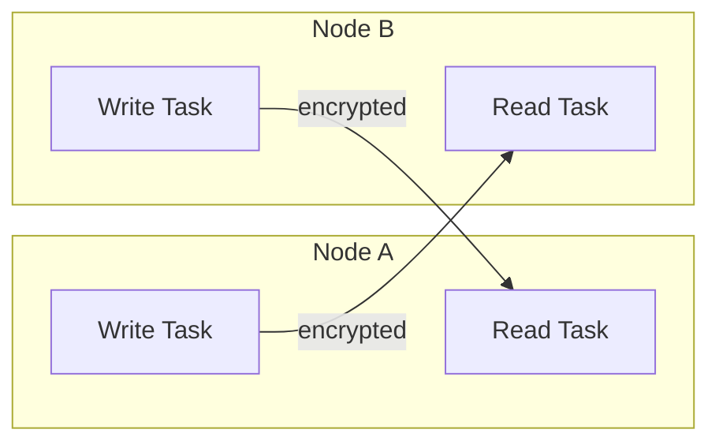
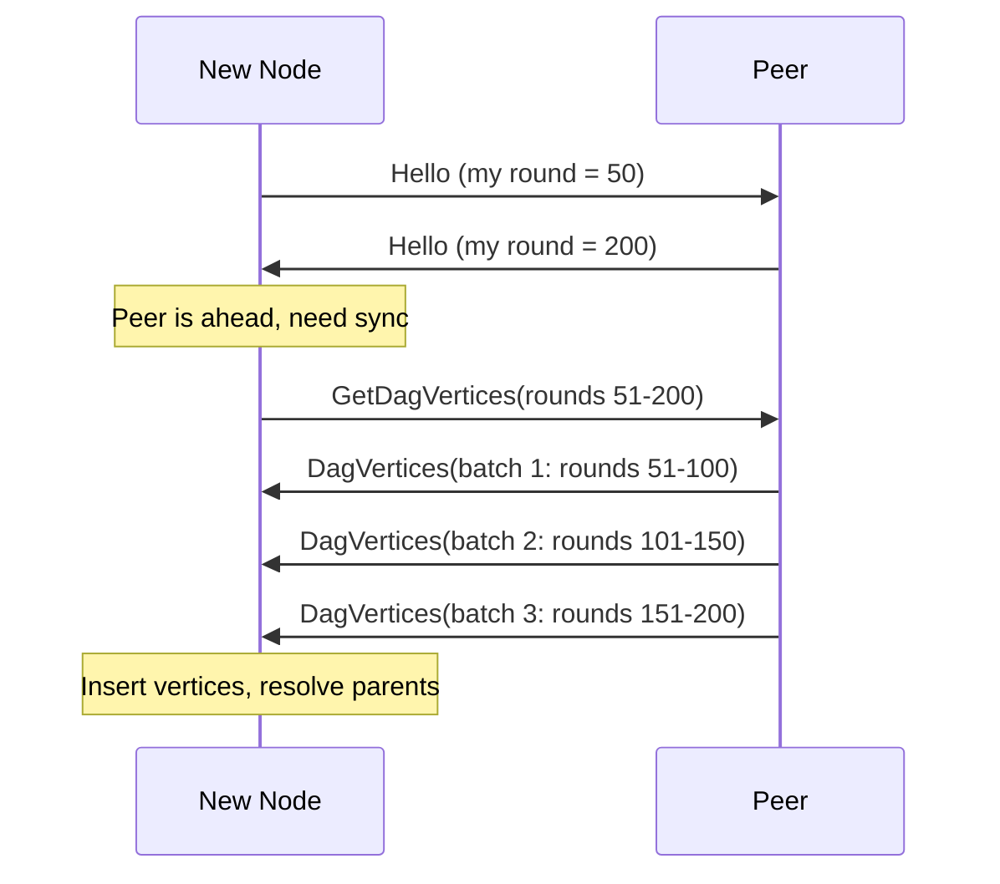
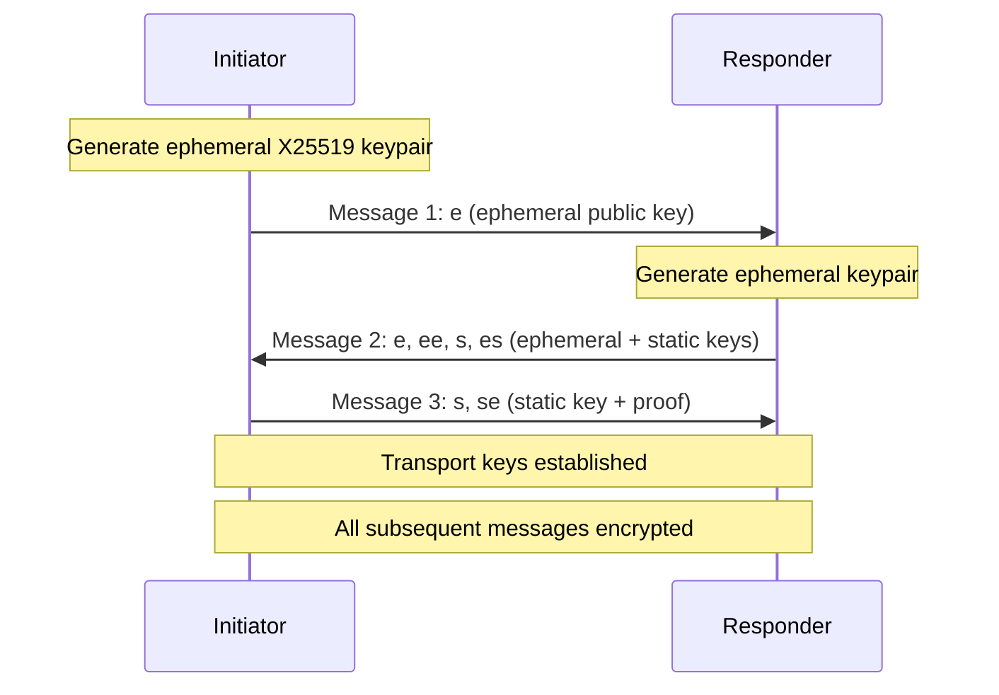

# P2P Network

UltraDAG's P2P layer handles encrypted communication between nodes, DAG vertex propagation, transaction gossip, and state synchronization. All traffic is encrypted using the Noise protocol framework.

---

## Transport Layer

### Noise Protocol Encryption

All connections use the **Noise_XX_25519_ChaChaPoly_BLAKE2s** handshake pattern:

- **XX pattern**: mutual authentication with static key exchange (3-message handshake)
- **X25519**: Diffie-Hellman key agreement (ephemeral + static keys)
- **ChaChaPoly**: AEAD symmetric encryption for application data
- **BLAKE2s**: hash function for key derivation

Every message after the handshake is encrypted with forward secrecy — compromising a node's long-term key does not decrypt past traffic.

See [Noise Encryption](../technical/noise-protocol.md) for the full protocol specification.

### Connection Model

Each peer connection uses **split read/write** streams:



- Connections are **bidirectional** — either side can send any message type
- Read and write are handled by separate async tasks for non-blocking I/O
- Connection lifecycle is managed with graceful shutdown on errors

### Wire Format

Messages use a simple framing protocol:

```
┌──────────────┬─────────────────────────┐
│ Length (4 B)  │ Payload (postcard bytes) │
└──────────────┴─────────────────────────┘
```

- **Length prefix**: 4-byte big-endian u32
- **Payload**: [postcard](https://docs.rs/postcard)-encoded binary message
- **Maximum message size**: 4 MB (4,194,304 bytes)

!!! note "Why postcard?"
    Postcard is a compact, deterministic binary serialization format built on serde. It produces smaller payloads than JSON or bincode with minimal overhead, which matters for IoT nodes on constrained networks.

---

## Message Types

| Message | Direction | Purpose |
|---------|-----------|---------|
| `Hello` | Bidirectional | Initial handshake, exchange node info and DAG state |
| `DagProposal` | Broadcast | New DAG vertex produced by this validator |
| `GetDagVertices` | Request | Request specific vertices by hash |
| `DagVertices` | Response | Batch of requested vertices |
| `NewTx` | Broadcast | New transaction for mempool inclusion |
| `CheckpointProposal` | Broadcast | Propose a new checkpoint |
| `CheckpointVote` | Broadcast | Co-sign a checkpoint proposal |
| `CheckpointSync` | Response | Full checkpoint with state snapshot |
| `EquivocationEvidence` | Broadcast | Two conflicting vertices from same validator+round |
| `Ping` / `Pong` | Bidirectional | Keepalive and latency measurement |

### Hello Message

The `Hello` message is exchanged immediately after the Noise handshake:

```rust
struct Hello {
    version: u32,
    network_id: [u8; 32],
    latest_round: u64,
    latest_finalized_round: u64,
    checkpoint_hash: Option<Hash>,
    validator: bool,
    peer_count: u32,
}
```

The `network_id` field provides domain separation — testnet and mainnet nodes will not connect to each other.

---

## DAG Sync Protocol

When a new node joins or a node falls behind, it must synchronize the DAG. There are two sync mechanisms:

### Incremental Sync (DAG Catch-Up)

For nodes that are slightly behind (within the pruning horizon):



**Orphan resolution**: If a received vertex references a parent hash that is not yet known:

1. The vertex is held in an orphan buffer
2. A `GetDagVertices` request is sent for the missing parent
3. When the parent arrives, the orphan is re-processed
4. This recurses until all ancestors are resolved or found in local state

### Checkpoint Sync (Fast-Sync)

For nodes that are far behind (beyond the pruning horizon) or joining fresh:

1. Request the latest checkpoint from a peer
2. Receive the checkpoint including:
    - State snapshot (full account/stake/governance state)
    - Checkpoint signatures (>2/3 validator co-signatures)
    - Suffix vertices (recent DAG vertices since the checkpoint)
3. Verify the checkpoint signatures
4. Load the state snapshot
5. Apply suffix vertices to catch up to the current round

!!! tip "Fast-sync vs full sync"
    Fast-sync takes seconds instead of potentially hours. New nodes default to checkpoint sync. Use `--skip-fast-sync` to force full DAG sync from genesis (only useful for verification purposes).

See [Checkpoint Protocol](../technical/checkpoints.md) for full details.

---

## Noise Handshake Flow

The XX pattern requires 3 messages:



After the handshake:

- Both parties have authenticated static keys
- Forward-secret transport keys are derived from ephemeral DH
- Validators additionally bind their Ed25519 identity to the Noise static key

---

## Rate Limiting

UltraDAG implements multi-layer rate limiting to prevent abuse:

### Per-Peer Aggregate Limit

| Parameter | Value |
|-----------|-------|
| Max messages per peer | 500 |
| Window | 60 seconds |

A peer exceeding 500 messages in any 60-second window is temporarily throttled.

### Per-Message-Type Cooldowns

| Message Type | Cooldown |
|-------------|----------|
| `DagProposal` | 1 per round per validator |
| `NewTx` | 100 per 10 seconds per peer |
| `GetDagVertices` | 10 per 10 seconds per peer |
| `CheckpointSync` | 1 per 60 seconds per peer |
| `Ping` | 1 per 5 seconds per peer |

### Violation Handling

Rate limit violations are handled progressively:

1. **First violation**: message is dropped silently
2. **Repeated violations**: peer is temporarily banned (5 minutes)
3. **Persistent abuse**: peer is permanently banned for the session

---

## Bootstrap Nodes

New nodes discover the network through bootstrap nodes. The testnet has 5 hardcoded bootstrap addresses:

```
ultradag-node-1.fly.dev:9333
ultradag-node-2.fly.dev:9333
ultradag-node-3.fly.dev:9333
ultradag-node-4.fly.dev:9333
ultradag-node-5.fly.dev:9333
```

After connecting to bootstrap nodes, the node learns additional peer addresses through the `Hello` message exchange and peer gossip. The `--no-bootstrap` flag disables automatic bootstrap connections (useful for isolated local testnets).

---

## Connection Management

### Peer Discovery

Peers are discovered through:

1. **Bootstrap nodes**: hardcoded addresses for initial connection
2. **Peer exchange**: nodes share known peer addresses during `Hello`
3. **Incoming connections**: any node can connect to a listening node

### Connection Limits

| Parameter | Default |
|-----------|---------|
| Max outgoing connections | 32 |
| Max incoming connections | 64 |
| Total connection limit | 96 |
| Connection timeout | 10 seconds |
| Idle timeout | 300 seconds |

### Reconnection

If a peer disconnects:

1. Wait 5 seconds before attempting reconnection
2. Exponential backoff up to 60 seconds
3. After 10 failed attempts, remove peer from known list
4. Bootstrap nodes are always retried regardless of failure count

---

## Network Security

### Eclipse Attack Prevention

An eclipse attack isolates a node by surrounding it with malicious peers. UltraDAG mitigates this through:

- **Checkpoint verification**: fast-sync checkpoints require >2/3 validator signatures
- **Diverse peer selection**: connects to peers across different IP ranges
- **Bootstrap diversity**: multiple independent bootstrap nodes

### Message Validation

All received messages are validated before processing:

- **Signatures**: Ed25519 signatures are verified with `verify_strict`
- **Round bounds**: vertices from the far future or deep past are rejected
- **Parent existence**: referenced parents must exist or be requested
- **Duplicate detection**: duplicate vertex hashes are discarded

See [Security Model](../security/model.md) for the full threat analysis.

---

## Next Steps

- [Noise Encryption](../technical/noise-protocol.md) — detailed Noise protocol specification
- [Checkpoint Protocol](../technical/checkpoints.md) — fast-sync and checkpoint co-signing
- [State Engine](state-engine.md) — how synced vertices become account state
