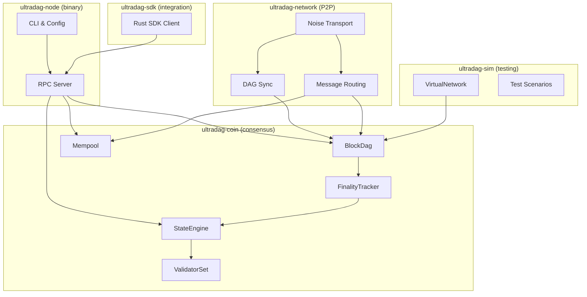
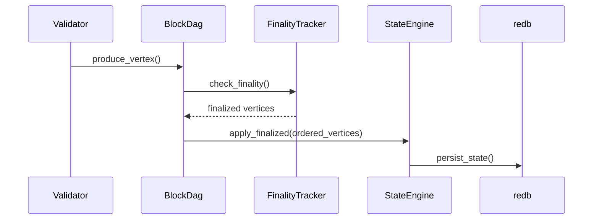

# Architecture Overview

UltraDAG is a lightweight DAG-BFT cryptocurrency designed from first principles for IoT and machine-to-machine micropayments. This page describes the system architecture, design philosophy, and how the major components fit together.

---

## Design Philosophy

Three principles guide every design decision in UltraDAG:

1. **Simplicity** — Every component must justify its complexity. The entire node compiles to a sub-2 MB binary. No virtual machine, no smart contracts, no account abstraction layers. Just a DAG-based ledger optimized for value transfer.

2. **Community-first governance** — The Council of 21 uses one-vote-per-seat governance with no stake requirement. Technical, business, legal, academic, and community seats ensure diverse representation. Stake does not buy governance power.

3. **Real decentralization** — The node runs on a $5/month VPS. A Raspberry Pi can be a full validator. If only well-funded entities can run nodes, the network is not decentralized. UltraDAG makes participation economically accessible.

---

## System Architecture



---

## Crate Structure

UltraDAG is organized as a Rust workspace with five crates:

| Crate | Type | Purpose |
|-------|------|---------|
| `ultradag-coin` | Library | Consensus engine, DAG, finality, state machine, tokenomics, governance |
| `ultradag-network` | Library | P2P transport, Noise encryption, DAG sync protocol, rate limiting |
| `ultradag-node` | Binary | Node entry point, CLI parsing, RPC server, orchestration |
| `ultradag-sim` | Library + Tests | Deterministic simulation harness, fault injection, invariant checking |
| `ultradag-sdk` | Library | Rust SDK for programmatic node interaction |

### Dependency Graph

```
ultradag-node
├── ultradag-coin
├── ultradag-network
│   └── ultradag-coin
└── ultradag-sdk (optional)

ultradag-sim
├── ultradag-coin
└── (no network dependency — uses VirtualNetwork)
```

The simulation crate deliberately avoids depending on `ultradag-network`. It replaces TCP with a `VirtualNetwork` abstraction that supports perfect delivery, random ordering, message drops, and network partitions — all deterministically seeded.

---

## Core Data Flow

The fundamental data flow through an UltraDAG node:

1. **Vertex production**: The local validator creates a `DagVertex` referencing parents from the current DAG tip
2. **Gossip**: The vertex is broadcast to all connected peers via the P2P layer
3. **DAG insertion**: Received vertices are validated and inserted into the `BlockDag`
4. **Finality check**: The `FinalityTracker` checks if any vertices have achieved >2/3 validator coverage
5. **State application**: Newly finalized vertices are ordered deterministically and applied to the `StateEngine`
6. **Persistence**: Updated state is written to the `redb` database



---

## Key Types

### DagVertex

The fundamental unit of the DAG. Each vertex contains:

- `validator: Address`: address of the producing validator
- `pub_key: [u8; 32]`: Ed25519 public key of the producing validator
- `round: u64`: monotonically increasing round number
- `parent_hashes: Vec<[u8; 32]>`: parent vertex hashes (up to `MAX_PARENTS=64`)
- `block: Block`: contains the coinbase transaction and a list of user transactions
- `signature: Signature`: Ed25519 signature over the vertex content
- `topo_level: u64`: topological level (computed on insert, not persisted)

The vertex hash is not stored as a field — it is computed via `DagVertex::hash()` using Blake3.

### BlockDag

The in-memory DAG structure. Holds vertices from the current window (after pruning). Provides:

- Vertex insertion with validation (signature, parent existence, round monotonicity)
- Parent selection for new vertex production
- Pruning of vertices below the pruning horizon

### FinalityTracker

Determines when vertices achieve BFT finality. Uses `BitVec` for O(1) per-vertex coverage tracking. A vertex is finalized when more than 2/3 of known validators (by count, not stake) have it as an ancestor. The BFT threshold is `ceil(2n/3)` by validator count.

### StateEngine

Derives account state from finalized DAG vertices. Maintains:

- Account balances and nonces
- Staking accounts (amount, commission)
- Delegation accounts (amount, validator, unlock round)
- Governance state (proposals, votes, council)
- Supply tracking with invariant enforcement

### ValidatorSet

Tracks the active and pending validator sets. Recalculated at epoch boundaries (every 210,000 rounds). Top 21 by effective stake become active.

---

## Workspace Layout

```
ultradag/
├── crates/
│   ├── ultradag-coin/       # Consensus, state, tokenomics
│   │   ├── src/
│   │   │   ├── address/     # Address type, derivation
│   │   │   ├── block/       # Block, BlockHeader, merkle root
│   │   │   ├── block_producer/ # Block/vertex creation
│   │   │   ├── consensus/   # dag.rs, finality.rs, vertex.rs, ordering.rs, checkpoint.rs, epoch.rs, validator_set.rs, persistence.rs
│   │   │   ├── governance/  # Council, proposals, voting, params
│   │   │   ├── persistence/ # redb persistence (db.rs)
│   │   │   ├── state/       # StateEngine (engine.rs)
│   │   │   ├── tx/          # Transaction types, mempool
│   │   │   ├── constants.rs # All protocol constants
│   │   │   ├── error.rs     # CoinError type
│   │   │   └── lib.rs
│   │   └── Cargo.toml
│   ├── ultradag-network/    # P2P, Noise, sync
│   │   ├── src/
│   │   │   ├── node/        # server.rs (NodeServer, P2P handlers)
│   │   │   ├── peer/        # connection.rs, noise.rs, registry.rs
│   │   │   ├── protocol/    # message.rs (wire protocol types)
│   │   │   ├── bootstrap.rs # Testnet bootstrap nodes
│   │   │   ├── metrics.rs   # Checkpoint metrics
│   │   │   └── lib.rs
│   │   └── Cargo.toml
│   ├── ultradag-node/       # Binary, CLI, RPC
│   │   ├── src/
│   │   │   ├── bin/         # loadtest.rs
│   │   │   ├── main.rs      # CLI parsing, node init, shutdown
│   │   │   ├── rpc.rs       # HTTP API handlers
│   │   │   ├── rate_limit.rs # RPC rate limiting
│   │   │   ├── validator.rs # Validator loop
│   │   │   └── lib.rs
│   │   └── Cargo.toml
│   ├── ultradag-sim/        # Simulation harness
│   │   ├── src/
│   │   │   ├── p2p/         # Virtual P2P network
│   │   │   ├── byzantine.rs # Byzantine strategies
│   │   │   ├── fuzz.rs      # Fuzz testing
│   │   │   ├── harness.rs   # Test harness
│   │   │   ├── invariants.rs # Invariant checking
│   │   │   ├── network.rs   # VirtualNetwork
│   │   │   ├── oracle.rs    # Test oracle
│   │   │   ├── properties.rs # Property-based tests
│   │   │   ├── txgen.rs     # Transaction generation
│   │   │   ├── validator.rs # Simulated validator
│   │   │   └── lib.rs
│   │   └── Cargo.toml
│   └── ultradag-sdk/        # Rust SDK
│       ├── src/
│       │   └── lib.rs
│       └── Cargo.toml
├── sdk/
│   ├── python/              # Python SDK
│   ├── javascript/          # JavaScript/TypeScript SDK
│   └── go/                  # Go SDK
├── formal/
│   └── UltraDAGConsensus.tla  # TLA+ specification
├── site/                    # Website assets
└── Cargo.toml               # Workspace root
```

---

## Conventions

UltraDAG follows strict code organization conventions:

- **`mod.rs` only re-exports** — no logic in module root files
- **Small files** — target < 200 lines per file, one concern per file
- **Inline unit tests** — every module has `#[cfg(test)]` tests
- **Integration tests** — cross-module tests live in `tests/`
- **No unsafe code** — zero instances of `unsafe` in the entire codebase
- **Comprehensive testing** — 836 tests across the core workspace

---

## Next Steps

- [DAG-BFT Consensus](consensus.md) — deep dive into the consensus protocol
- [P2P Network](network.md) — transport, encryption, and sync
- [State Engine](state-engine.md) — account state derivation and persistence
