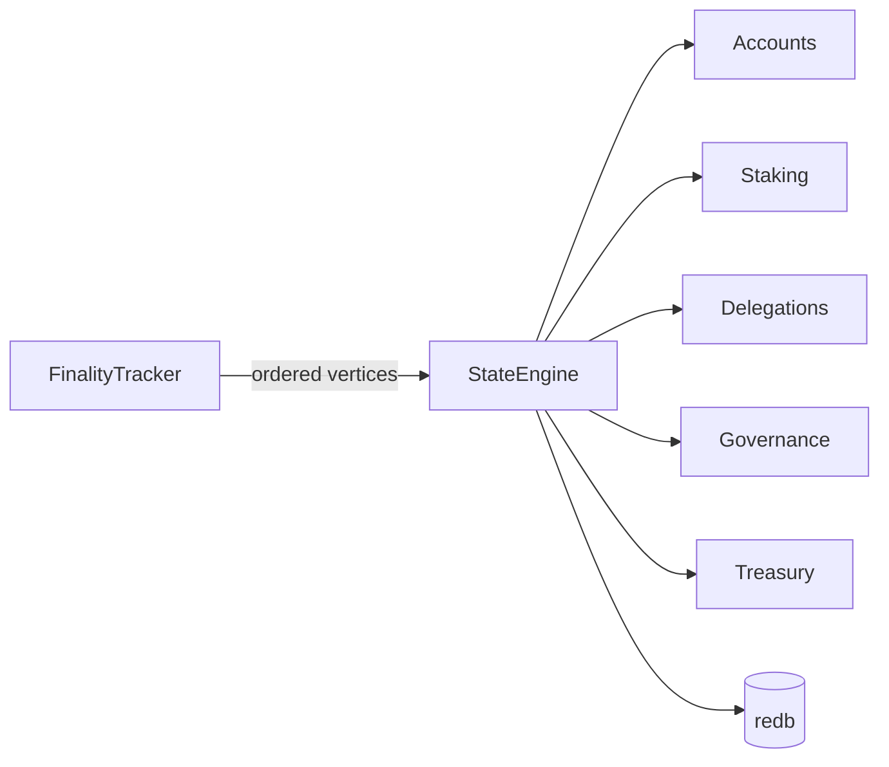

# State Engine

The `StateEngine` derives account state from finalized DAG vertices. It is the authoritative source of balances, staking positions, delegations, governance state, and supply accounting. All state transitions are deterministic — given the same ordered sequence of finalized vertices, every honest node produces identical state.

---

## Overview



The state engine receives finalized vertices in deterministic order (sorted by `(round, hash)`) and processes each transaction within them. After processing, the updated state is persisted to the `redb` ACID database.

---

## Account Model

### Accounts

Every address has an implicit account with:

| Field | Type | Description |
|-------|------|-------------|
| `balance` | `u64` | Liquid balance in sats (1 UDAG = 100,000,000 sats) |
| `nonce` | `u64` | Transaction counter for replay protection |

Accounts are created implicitly on first receipt of funds. There is no explicit account creation transaction.

### Stake Accounts

Validators have an additional stake account:

| Field | Type | Description |
|-------|------|-------------|
| `staked` | `u64` | Amount staked in sats |
| `unlock_at_round` | `Option<u64>` | Set when unstake is initiated |
| `commission_percent` | `u8` | Delegation commission (0-100%, default 10) |

### Delegation Accounts

Delegators have delegation records:

| Field | Type | Description |
|-------|------|-------------|
| `delegated_amount` | `u64` | Amount delegated in sats |
| `validator` | `Address` | Target validator address |
| `unlock_at_round` | `Option<u64>` | Set when undelegate is initiated |

---

## Supply Invariant

The most critical invariant in UltraDAG:

$$
\text{liquid} + \text{staked} + \text{delegated} + \text{treasury} = \text{total\_supply}
$$

Where:

- **liquid**: sum of all account balances
- **staked**: sum of all staked amounts
- **delegated**: sum of all delegated amounts
- **treasury**: protocol-held funds (genesis allocations, pending governance)
- **total_supply**: total UDAG minted to date (capped at 21,000,000 UDAG)

!!! danger "FATAL on violation"
    The supply invariant is checked after every state transition. If it ever fails, the node terminates with exit code **101**. This is a deliberate design choice — it is better to halt than to continue with inconsistent state.

    ```
    FATAL: Supply invariant violated!
    liquid=X staked=Y delegated=Z treasury=W total_supply=T
    X + Y + Z + W != T
    Exit code: 101
    ```

    A supply invariant violation would indicate a critical bug in the state engine. The circuit breaker ensures no node ever persists or propagates invalid state.

---

## Transaction Processing Pipeline

Each finalized vertex is processed through this pipeline:

### 1. Per-Round Protocol Actions

Before processing transactions, the protocol executes per-round actions:

1. **Reward minting**: mint the current round reward (starts at 1 UDAG, halves every 10.5M rounds)
2. **Reward distribution**: distribute rewards to active validators (proportional to effective stake)
3. **Council reward**: allocate council emission share (default 10%)
4. **Epoch boundary**: if at epoch boundary (every 210,000 rounds), recalculate the active validator set
5. **Governance execution**: execute any proposals past their execution delay

!!! note "Per-round, not per-vertex"
    Rewards are minted once per round, not once per vertex. `distribute_round_rewards()` runs once per finalized round at the round boundary in `apply_finalized_vertices()`, collecting all vertex producers for that round first, then distributing rewards proportionally to all stakers.

### 2. Transaction Validation

Each transaction is validated:

- **Signature**: Ed25519 `verify_strict` against `pub_key`
- **Address match**: `from` address must equal `blake3(pub_key)`
- **Nonce**: must equal account's current nonce (sequential, no gaps)
- **Balance**: sender must have sufficient funds for amount + fee
- **Type-specific**: each transaction type has additional validation rules

### 3. Transaction Execution

Validated transactions are applied atomically:

| Transaction Type | State Changes |
|-----------------|---------------|
| **Transfer** | Debit sender, credit recipient, increment nonce, collect fee |
| **Stake** | Move from balance to staked, create/update StakeAccount |
| **Unstake** | Begin cooldown, set unlock_at_round |
| **Delegate** | Move from balance to delegated, create DelegationAccount |
| **Undelegate** | Begin cooldown, set unlock_at_round |
| **SetCommission** | Update commission_percent on StakeAccount |
| **CreateProposal** | Create governance proposal, collect fee, increment nonce |
| **Vote** | Record vote on proposal |

### 4. Invariant Check

After all transactions in a vertex are processed, the supply invariant is verified.

### 5. Persistence

The updated state is written to the `redb` database within a single ACID transaction.

---

## Persistence: redb Database

UltraDAG uses [redb](https://docs.rs/redb) as its embedded ACID database. redb provides:

- **ACID transactions**: all state updates are atomic, consistent, isolated, durable
- **Crash recovery**: database survives unexpected node termination
- **Zero external dependencies**: embedded in the binary, no separate database server
- **Small footprint**: appropriate for IoT and edge deployments

### Database Tables

| Table | Key | Value | Purpose |
|-------|-----|-------|---------|
| `accounts` | `[u8; 32]` | `(u64, u64)` | Account balances (balance, nonce) |
| `stakes_v2` | `[u8; 32]` | `&[u8]` (postcard) | Validator stake records (includes commission_percent) |
| `delegations` | `[u8; 32]` | `&[u8]` (postcard) | Delegation records (keyed by delegator address) |
| `proposals` | `u64` | `&[u8]` | Governance proposals |
| `votes` | `&[u8]` | `u8` | Governance votes |
| `metadata` | `&str` | `&[u8]` | Total supply, latest round, state root, configured_validator_count |
| `active_validators` | `u64` | `&[u8; 32]` | Active validator set |
| `council_members` | `[u8; 32]` | `&[u8]` | Council membership with seat category |

### Transaction Safety

All state modifications occur within a `redb` write transaction:

```rust
let write_txn = db.begin_write()?;
{
    let mut accounts = write_txn.open_table(ACCOUNTS_TABLE)?;
    accounts.insert(sender, (new_balance, new_nonce))?;
    accounts.insert(recipient, (recipient_balance, recipient_nonce))?;
}
write_txn.commit()?;
```

If the node crashes mid-transaction, the database rolls back to the last committed state. No partial updates are ever persisted.

---

## Checkpoint Snapshots

The state engine produces checkpoint snapshots every 100 finalized rounds:

### State Root Computation

The state root is a deterministic hash of the entire state:

```
state_root = blake3(
    VERSION_PREFIX ||
    blake3(sorted_accounts) ||
    blake3(sorted_stakes) ||
    blake3(sorted_delegations) ||
    blake3(sorted_proposals) ||
    total_supply ||
    latest_finalized_round
)
```

!!! warning "Canonical byte encoding"
    The state root uses **canonical byte encoding** — each value is serialized to a fixed-size byte representation, not through serde. This prevents serialization format changes from altering the state root. The `VERSION_PREFIX` allows future state schema migrations.

### Snapshot Contents

A checkpoint snapshot contains:

- State root hash
- Full account table dump
- Full stake table dump
- Full delegation table dump
- Active governance proposals
- Current supply and round metadata
- Co-signatures from >2/3 validators

See [Checkpoint Protocol](../technical/checkpoints.md) for the full checkpoint lifecycle.

---

## Cooldown Mechanics

Unstaking and undelegating have a cooldown period:

| Operation | Cooldown |
|-----------|----------|
| Unstake | 2,016 rounds (~2.8 hours) |
| Undelegate | 2,016 rounds (~2.8 hours) |

During cooldown:

- Funds do not earn staking or delegation rewards
- Funds cannot be transferred
- The `unlock_at_round` field tracks when cooldown expires
- When the current round reaches `unlock_at_round`, funds move back to liquid balance

Cooldown processing happens as part of per-round protocol actions.

---

## Error Handling

### Transaction Failures

If a transaction fails validation (insufficient balance, bad nonce, etc.):

- The transaction is **skipped** — it does not affect state
- Remaining transactions in the vertex continue processing
- Failed transactions are logged but do not cause vertex rejection

### State Corruption

If state corruption is detected (supply invariant failure, impossible balance):

- The node logs a FATAL error with full diagnostic information
- The node exits with a specific error code
- No corrupted state is persisted or propagated

| Exit Code | Meaning |
|-----------|---------|
| 100 | Finality rollback detected (should never happen) |
| 101 | Supply invariant violation |

---

## Next Steps

- [Supply & Emission](../tokenomics/supply.md) — how new UDAG enters circulation
- [Staking & Delegation](../tokenomics/staking.md) — validator economics
- [Checkpoint Protocol](../technical/checkpoints.md) — state snapshots and fast-sync
