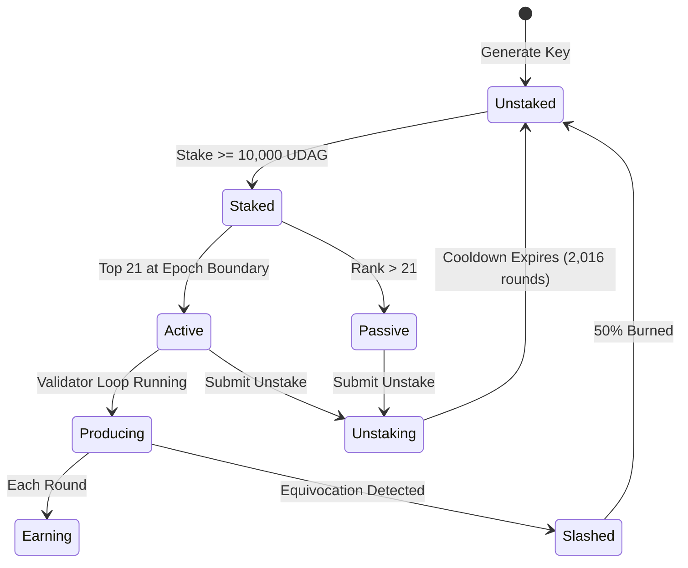

# Validator Handbook

A comprehensive operational guide for UltraDAG validators covering key management, rewards, slashing prevention, and performance optimization.

---

## Requirements

| Requirement | Minimum |
|------------|---------|
| Stake | 10,000 UDAG |
| CPU | 1 core |
| RAM | 128 MB |
| Disk | 1 GB (with pruning) |
| Network | Stable internet, low latency to peers |
| Uptime | 99%+ recommended |

!!! info "Lightweight by design"
    UltraDAG is purpose-built for constrained hardware. A $5/month VPS or Raspberry Pi 4 can run a full validator.

---

## Key Management

### Private Key Sources

The validator identity is loaded in priority order:

1. **`--pkey` flag**: hex-encoded 64-character Ed25519 secret key on the command line
2. **`validator.key` file**: plain text file in the data directory containing the hex key
3. **Auto-generated**: a new keypair is generated if neither source is available

### Key File

```bash
# Generate a key offline and save it
echo "YOUR_64_CHAR_HEX_SECRET_KEY" > /etc/ultradag/validator.key
chmod 600 /etc/ultradag/validator.key
chown ultradag:ultradag /etc/ultradag/validator.key
```

### Key Security Best Practices

- Generate keys on an air-gapped machine
- Never transmit private keys over the network
- Store backups in encrypted cold storage
- Use file permissions to restrict access (`chmod 600`)
- Never commit keys to version control
- Consider hardware wallet storage for mainnet

!!! danger "One key, one node"
    Never run two validator instances with the same key. This causes equivocation (two different vertices in the same round), which triggers automatic slashing of 50% of your stake.

---

## Staking Lifecycle



### Step-by-Step

1. **Fund your address**: acquire at least 10,000 UDAG
2. **Stake**: submit a `Stake` transaction
3. **Wait for epoch boundary**: active set recalculated every 210,000 rounds
4. **Produce vertices**: your node produces one vertex per round
5. **Earn rewards**: proportional to your effective stake
6. **Unstake (optional)**: submit `Unstake`, wait 2,016 rounds for cooldown

---

## Reward Calculation

### Active Validator

Each round, the protocol distributes the block reward:

$$
\text{your\_reward} = \text{round\_reward} \times (1 - \text{council\_pct}) \times \frac{\text{your\_effective\_stake}}{\sum \text{all\_effective\_stakes}}
$$

**Example** at default settings (1 UDAG/round, 10% council, 5 equal validators):

| Component | Value |
|-----------|-------|
| Round reward | 1.0 UDAG |
| Council share (10%) | 0.1 UDAG |
| Validator pool | 0.9 UDAG |
| Your share (1/5) | 0.18 UDAG |
| Per day (~17,280 rounds) | ~3,110 UDAG |

### Passive Staker

If ranked outside top 21, you earn 20% of the active rate:

$$
\text{passive\_reward} = \text{active\_equivalent} \times 0.20
$$

### Commission from Delegations

As a validator with delegations, you earn commission on delegated rewards:

| Component | Formula |
|-----------|---------|
| Your own share | `reward * (own_stake / effective_stake)` |
| Delegation pool | `reward * (delegated / effective_stake)` |
| Your commission | `delegation_pool * (commission_pct / 100)` |
| **Total** | own share + commission |

---

## Commission Management

Set your commission rate (default 10%):

```bash
curl -X POST http://localhost:10333/set-commission \
  -H "Content-Type: application/json" \
  -d '{"secret_key": "YOUR_KEY", "commission_percent": 15}'
```

**Commission strategy considerations:**

- **Low commission** (0-5%): attracts more delegators, increases effective stake
- **Medium commission** (5-15%): balanced revenue and delegation attraction
- **High commission** (15-50%): maximizes per-delegation revenue but may deter delegators
- **100% commission**: takes all delegation rewards (delegators earn nothing)

---

## Slashing Prevention

### What Causes Slashing

The only slashing condition is **equivocation**: producing two different vertices for the same round.

### How to Prevent It

1. **Never run duplicate nodes**: one key = one active node, always
2. **Clean restarts**: ensure the old process is fully stopped before starting a new one
3. **Monitor process health**: use systemd or similar to prevent double-starts
4. **Avoid clock issues**: ensure NTP is configured and stable

### Slashing Impact

| Aspect | Impact |
|--------|--------|
| Stake burn | 50% of your staked amount (governable 10-100%) |
| Delegation cascade | All delegators also lose 50% |
| Active set | Removed if stake falls below 10,000 UDAG |
| Supply effect | Slashed amount is burned (deflationary) |
| Detection | Automatic, deterministic, no appeals |

!!! danger "Slashing is permanent"
    Burned stake cannot be recovered. There is no governance mechanism to reverse a slash — the evidence is cryptographically verifiable.

---

## Performance Optimization

### Network

- Use a VPS with low-latency connectivity to other validators
- Ensure P2P port (default 9333) is directly accessible (no NAT)
- Consider geographic proximity to existing validators

### Storage

- Default pruning (1000 rounds) keeps disk usage bounded
- Use SSD for the data directory (redb benefits from fast random I/O)
- Monitor disk usage: `du -sh ~/.ultradag/node/`

### Monitoring

- Set up [Prometheus + Grafana](monitoring.md) for real-time metrics
- Alert on finality lag > 5 rounds
- Alert on peer count dropping below 2
- Monitor memory usage (should stay under 512 MB)

---

## Governance Participation

As a validator, you may also serve as a council member (no stake requirement). Council participation involves:

- **Voting on proposals**: review and vote on parameter changes
- **Creating proposals**: submit improvements for network governance
- **Monitoring**: watch for parameter change proposals that affect validator economics

See [Governance](../tokenomics/governance.md) for full details.

---

## Operational Checklist

### Daily

- [ ] Verify node is producing vertices (`curl /status`)
- [ ] Check finality lag is <= 3 (`curl /health/detailed`)
- [ ] Review logs for warnings or errors

### Weekly

- [ ] Check disk usage
- [ ] Verify backup integrity
- [ ] Review delegator activity
- [ ] Check for software updates

### Per Epoch (~12 days)

- [ ] Verify you remained in the active set
- [ ] Review reward accumulation
- [ ] Assess commission rate competitiveness
- [ ] Check governance proposals requiring votes

---

## Next Steps

- [Monitoring](monitoring.md) — Prometheus and Grafana setup
- [Staking & Delegation](../tokenomics/staking.md) — full tokenomics details
- [CLI Reference](cli.md) — all configuration flags
