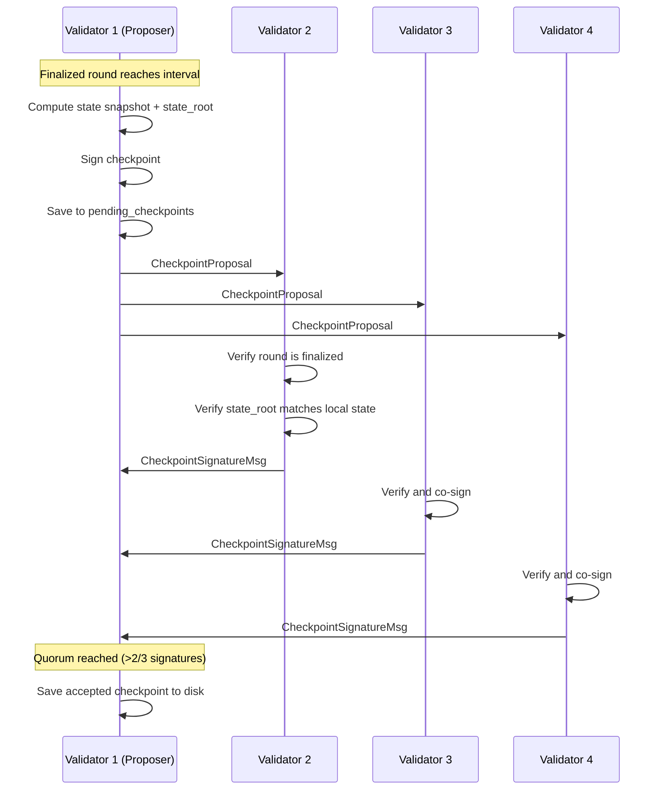
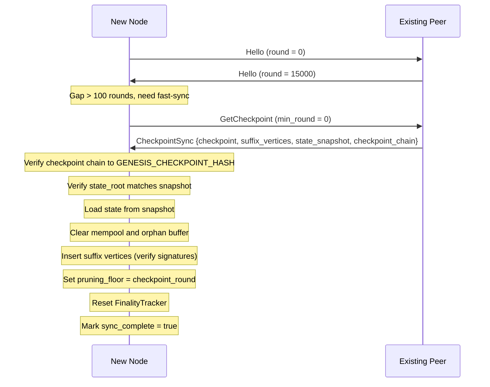

# Checkpoint Protocol

Checkpoints are BFT-signed state snapshots that enable fast-sync for new nodes. Instead of replaying the full DAG history, a new node can download a verified checkpoint, load the state, and sync only the recent suffix.

---

## Overview

| Parameter | Value |
|-----------|-------|
| Production interval | Every 100 finalized rounds (~8 minutes at 5s rounds) |
| Signature requirement | >2/3 validator co-signatures |
| Chain anchor | `GENESIS_CHECKPOINT_HASH` (hardcoded) |
| Retention | Last 10 checkpoints on disk |

---

## Checkpoint Structure

Each checkpoint contains:

| Field | Type | Description |
|-------|------|-------------|
| `round` | `u64` | The finalized round this checkpoint covers |
| `state_root` | `[u8; 32]` | Blake3 hash of the canonical state |
| `dag_tip` | `[u8; 32]` | Hash of the latest DAG vertex |
| `total_supply` | `u64` | Total UDAG supply at this round |
| `signatures` | `Vec<(Address, Signature)>` | Validator co-signatures |
| `prev_checkpoint_hash` | `[u8; 32]` | Hash of the previous checkpoint (chain link) |

---

## Production Lifecycle



### Production Steps

1. **Trigger**: when `last_finalized_round % CHECKPOINT_INTERVAL == 0`
2. **Snapshot**: compute state snapshot and state root while holding the state lock
3. **Race check**: verify `state.last_finalized_round() == checkpoint_round` (abort if state advanced concurrently)
4. **Chain link**: set `prev_checkpoint_hash` from the most recent local checkpoint
5. **Sign**: Ed25519 sign the checkpoint
6. **Store locally**: insert into `pending_checkpoints`
7. **Broadcast**: send `CheckpointProposal` to all peers

!!! note "Boundary crossing"
    Finality can jump across checkpoint boundaries (e.g., 198 to 201). The checkpoint production logic iterates all crossed multiples of `CHECKPOINT_INTERVAL` to ensure no checkpoint is missed.

---

## Co-Signing

When a validator receives a `CheckpointProposal`:

1. **Verify round**: the proposed round must be finalized locally
2. **Verify state root**: recompute from local state and compare
3. **Verify at least one valid signature**: reject proposals with zero valid signers
4. **Co-sign**: add own signature and send `CheckpointSignatureMsg` back

When a `CheckpointSignatureMsg` is received:

1. **Verify signature**: Ed25519 `verify_strict` against the signer's public key
2. **Accumulate**: add to the pending checkpoint's signature list
3. **Check quorum**: if `signatures.len() > ceil(2N/3)`, mark checkpoint as accepted
4. **Save**: write accepted checkpoint to disk

---

## Checkpoint Chain

Checkpoints form a hash chain anchored to genesis:

```
GENESIS_CHECKPOINT_HASH <-- Checkpoint(round=100) <-- Checkpoint(round=200) <-- ...
```

| Property | Description |
|----------|-------------|
| `prev_checkpoint_hash` | Blake3 hash of the previous checkpoint |
| Genesis anchor | `GENESIS_CHECKPOINT_HASH` is hardcoded in the binary |
| Chain verification | Walk backwards, verify each link |
| Cycle detection | Visited set prevents infinite loops |

### Chain Verification Algorithm

```
function verify_chain(checkpoint, known_checkpoints):
    visited = {}
    current = checkpoint
    while current.prev_hash != GENESIS_CHECKPOINT_HASH:
        if current.hash in visited:
            return ERROR("cycle detected")
        visited.add(current.hash)
        parent = known_checkpoints[current.prev_hash]
        if parent is None:
            return ERROR("broken chain")
        current = parent
    return OK
```

---

## Fast-Sync (New Node Joining)

When a new node joins the network:



### CheckpointSync Message Contents

| Field | Purpose |
|-------|---------|
| `checkpoint` | The signed checkpoint |
| `suffix_vertices` | Recent DAG vertices since the checkpoint (max 500) |
| `state_at_checkpoint` | Full state snapshot at checkpoint time |
| `checkpoint_chain` | Full chain of checkpoints back to genesis |

### Validation Steps

1. **Chain verification**: verify `checkpoint_chain` links back to `GENESIS_CHECKPOINT_HASH`
2. **Quorum check**: verify >2/3 validator signatures (using the checkpoint's own state for trust)
3. **State root verification**: compute `blake3(state_snapshot)` and compare to `checkpoint.state_root`
4. **Snapshot size validation**: reject oversized snapshots (max 10M accounts, 10K proposals)
5. **Suffix verification**: verify Ed25519 signatures on all suffix vertices

---

## Eclipse Attack Prevention

The checkpoint chain provides defense against eclipse attacks on fresh nodes:

| Attack | Defense |
|--------|---------|
| Fabricated state with fake validators | Chain must link to hardcoded `GENESIS_CHECKPOINT_HASH` |
| Forged checkpoint signatures | Signatures verified against checkpoint's own validator set |
| Chain skipping | Verification walks the entire chain, no shortcuts |

!!! danger "Chain verification is never skipped"
    Even fresh nodes with zero local checkpoints verify the full chain. The `GENESIS_CHECKPOINT_HASH` is computed from the genesis state and baked into the binary at compile time.

---

## Checkpoint Pruning

To bound disk usage, old checkpoints are pruned:

| Parameter | Value |
|-----------|-------|
| Retained checkpoints | 10 (most recent) |
| Minimum retained | 2 (for chain continuity) |
| Pruning trigger | After each new checkpoint production |

Pruning deletes checkpoint files from disk but retains enough history for new nodes to fast-sync and for chain verification to work.

---

## State Snapshot

The state saved alongside each checkpoint includes:

| Component | Description |
|-----------|-------------|
| Account table | All (address, balance, nonce) tuples |
| Stake table | All (address, staked_amount, commission) tuples |
| Delegation table | All (delegator, validator, amount, unlock) tuples |
| Proposal table | All governance proposals |
| Vote table | All governance votes |
| Council members | Current council membership |
| Governance params | Current governable parameters |
| Metadata | Total supply, finalized round, configured validators |

The snapshot is saved to a separate file (`checkpoint_state_ROUND.bin`) alongside the checkpoint (`checkpoint_ROUND.bin`).

---

## Next Steps

- [P2P Network](../architecture/network.md) — sync protocol details
- [State Engine](../architecture/state-engine.md) — state root computation
- [Noise Encryption](noise-protocol.md) — transport security
