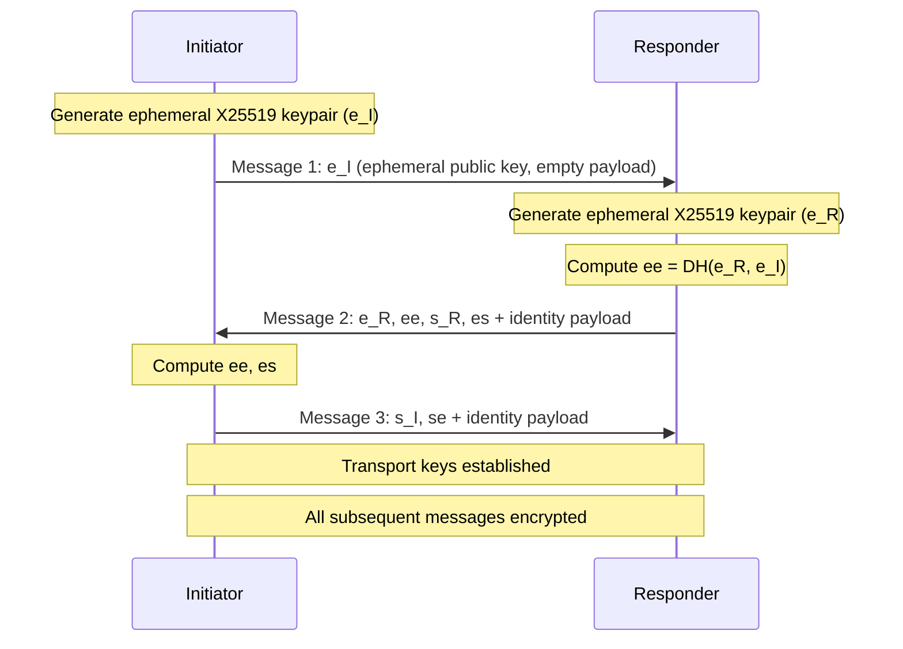

# Noise Protocol Encryption

All UltraDAG P2P connections are encrypted using the Noise protocol framework. This page describes the handshake pattern, identity binding, and transport encryption.

---

## Protocol Selection

| Parameter | Choice | Rationale |
|-----------|--------|-----------|
| Pattern | Noise_XX | Mutual authentication without prior key knowledge |
| Key exchange | X25519 | Fast, well-audited ECDH |
| Cipher | ChaChaPoly1305 | AEAD with wide platform support |
| Hash | BLAKE2s | Fast, secure, small output |
| Implementation | `snow` crate v0.9 | Pure Rust, audited |

### Why Noise_XX?

The XX pattern provides mutual authentication where neither party knows the other's static key in advance. This is ideal for a P2P network where:

- Nodes discover peers dynamically
- Validator identity must be verified
- Observer nodes connect without a validator identity

---

## Forward Secrecy

Every connection generates a fresh **ephemeral X25519 keypair**. Session keys are derived from ephemeral Diffie-Hellman, not from long-term keys. This means:

- Compromising a node's static key does **not** decrypt past traffic
- Each session has unique encryption keys
- Ephemeral keys are not persisted to disk

---

## Handshake Flow

The XX pattern requires a 3-message handshake:



### Message Details

| Message | Contains | Encrypted |
|---------|----------|-----------|
| 1 (`-> e`) | Initiator's ephemeral public key | No |
| 2 (`<- e, ee, s, es`) | Responder's ephemeral + static keys, DH results | Partially (static key encrypted) |
| 3 (`-> s, se`) | Initiator's static key, DH result | Yes |

After message 3, both parties derive identical transport keys for bidirectional encrypted communication.

### Timeout

The handshake must complete within **10 seconds** (`HANDSHAKE_TIMEOUT_SECS`). Connections that fail to handshake in time are dropped.

---

## Validator Identity Binding

Validators bind their Ed25519 identity to the Noise session:

### Identity Payload Format

```
Validator:  [0x01] [32 bytes: Ed25519 public key] [64 bytes: Ed25519 signature]
Observer:   [0x00]
```

The Ed25519 signature covers:

```
NETWORK_ID || b"noise-identity" || noise_static_public_key
```

### Verification

When receiving an identity payload:

1. Check the first byte: `0x01` = validator, `0x00` = observer
2. For validators:
    - Extract the Ed25519 public key (32 bytes)
    - Extract the Ed25519 signature (64 bytes)
    - Verify the signature against `NETWORK_ID || "noise-identity" || peer_noise_static_key`
    - Derive the address: `blake3(ed25519_public_key)`
3. Store the `PeerIdentity` for logging and validation

### Result

After the handshake, both parties have:

```rust
struct HandshakeResult {
    transport: Arc<Mutex<TransportState>>,  // Noise transport for encryption
    peer_identity: Option<PeerIdentity>,    // Ed25519 identity (if validator)
}

struct PeerIdentity {
    ed25519_pubkey: [u8; 32],
    address: Address,
}
```

---

## Observer Support

Nodes without a validator identity connect encrypted but unauthenticated:

- Handshake payload contains only `[0x00]`
- The connection is still fully encrypted (ChaChaPoly)
- The peer has no verified identity
- Observers can sync the DAG, submit transactions, and serve RPC

!!! info "Encryption without authentication"
    Observer connections provide **confidentiality** (traffic is encrypted) but not **authentication** (the peer's identity is not verified). This is appropriate for nodes that do not produce vertices and have no stake at risk.

---

## Message Chunking

The Noise specification limits each encrypted message to **65,535 bytes**. UltraDAG messages can be up to 4 MB. Large messages are transparently chunked:

### Chunk Parameters

| Parameter | Value |
|-----------|-------|
| Max Noise plaintext | 65,519 bytes (`65535 - 16` for Poly1305 tag) |
| Max message size | 4,194,304 bytes (4 MB) |
| Max chunks | `(total_len / 64) + 128` |

### Wire Format (Encrypted)

```
┌──────────────────────────┬──────────────────┬──────────────────┐
│ Total plaintext len (4B) │ Chunk 1 len (2B) │ Chunk 1 ciphertext│
│                          ├──────────────────┼──────────────────┤
│                          │ Chunk 2 len (2B) │ Chunk 2 ciphertext│
│                          ├──────────────────┼──────────────────┤
│                          │ ...              │ ...              │
└──────────────────────────┴──────────────────┴──────────────────┘
```

### Sending

1. Serialize the message to plaintext bytes
2. Write the total plaintext length (4 bytes, big-endian)
3. Split into chunks of at most `NOISE_MAX_PLAINTEXT` bytes
4. For each chunk: encrypt with Noise transport, write chunk length (2 bytes) + ciphertext
5. All chunks are encrypted under the Noise lock, then written under the writer lock

### Receiving

1. Read total plaintext length (4 bytes)
2. Compute `max_chunks = (total_len / 64) + 128` (amplification protection)
3. Loop: read chunk length (2 bytes), read ciphertext, decrypt
4. Concatenate decrypted chunks until total_len bytes received
5. Deserialize the complete plaintext message

### Amplification Protection

Without chunk limits, a malicious peer could claim `total_len = 4MB` but send 1-byte chunks, causing ~4 million decrypt operations (each acquiring the Noise mutex). The `max_chunks` cap prevents this attack.

---

## Lock Ordering

The Noise transport and TCP writer use separate locks. To prevent deadlocks:

1. **Encrypt all chunks** under the Noise transport lock
2. **Release** the Noise lock
3. **Write all encrypted chunks** under the writer lock

The Noise lock and writer lock are **never held simultaneously**.

---

## Connection Sites

The Noise handshake is performed at all 3 connection sites:

| Site | Role | Code Path |
|------|------|-----------|
| `listen()` | Responder | Incoming connections |
| `connect_to()` | Initiator | Outgoing connections during startup |
| `try_connect_peer()` | Initiator | Reconnection and peer discovery |

All sites use the same handshake timeout (10 seconds) and identity verification logic.

---

## Security Properties

| Property | Guarantee |
|----------|-----------|
| Confidentiality | All messages encrypted with ChaChaPoly |
| Forward secrecy | Per-connection ephemeral X25519 keys |
| Integrity | Poly1305 authentication tag on every chunk |
| Validator authentication | Ed25519 signature over Noise static key |
| Replay protection | Noise nonce mechanism |
| Anti-tampering | AEAD rejects modified ciphertext |

---

## Next Steps

- [P2P Network](../architecture/network.md) — network architecture overview
- [Security Model](../security/model.md) — full security architecture
- [Checkpoint Protocol](checkpoints.md) — state sync over encrypted channels
