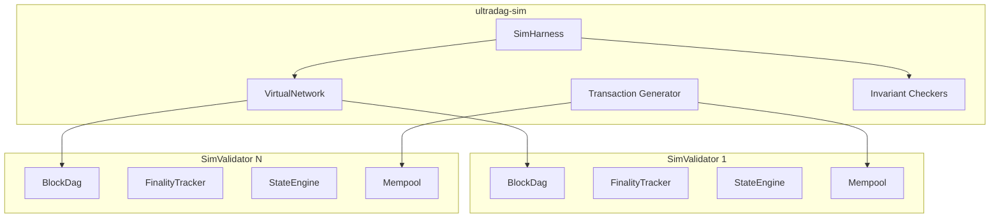

# Simulation Harness

The `ultradag-sim` crate provides a deterministic consensus simulation for testing DAG-BFT logic without any network I/O. It uses the **real** `BlockDag`, `FinalityTracker`, `StateEngine`, and `Mempool` from `ultradag-coin` — only the network layer is replaced with a virtual network.

---

## Architecture



### Key Design Decisions

- **No TCP, no Tokio, no async**: purely synchronous, deterministic execution
- **Real consensus logic**: uses production `BlockDag`, `FinalityTracker`, `StateEngine`, `Mempool`
- **Virtual network**: message delivery controlled by the harness
- **Deterministic seeding**: all randomness from `ChaCha8Rng` with configurable seed
- **Master invariant**: all honest validators that finalize the same round produce identical `compute_state_root()` output

---

## Components

### VirtualNetwork

Controls message delivery between simulated validators:

| Delivery Mode | Behavior |
|--------------|----------|
| `Perfect` | All messages delivered immediately in order |
| `RandomOrder` | Messages delivered but in random order |
| `Drop(rate)` | Messages dropped with probability `rate` |
| `Partition(groups)` | Messages only delivered within partition groups |
| `Lossy(rate)` | Random message loss at the specified rate |

```rust
let network = VirtualNetwork::new(DeliveryMode::Lossy(0.05)); // 5% loss
```

### SimValidator

A lightweight wrapper around real consensus components:

```rust
struct SimValidator {
    address: Address,
    keypair: Keypair,
    dag: BlockDag,
    finality: FinalityTracker,
    state: StateEngine,
    mempool: Mempool,
    is_byzantine: bool,
    strategy: Option<ByzantineStrategy>,
}
```

Each `SimValidator` instance uses identical code to a production node, differing only in that messages are delivered through the `VirtualNetwork` instead of TCP.

### ByzantineStrategy

Strategies for Byzantine validators:

| Strategy | Behavior |
|----------|----------|
| `Equivocator` | Produces two different vertices per round (conflicting content) |
| `Withholder` | Produces vertices but does not broadcast them |
| `Crash` | Stops producing after a configured round |
| `TimestampManipulator` | Produces vertices with manipulated timestamps |

```rust
let strategy = ByzantineStrategy::Equivocator;
```

### SimHarness

The driver that orchestrates simulation rounds:

1. For each round, each honest validator produces a vertex
2. Byzantine validators execute their strategy
3. Messages are delivered through the VirtualNetwork
4. Each validator processes received vertices (insert, finality check, state apply)
5. Invariants are checked after each round

### Invariant Checkers

Automated checks run after every round:

| Invariant | Description |
|-----------|-------------|
| **State convergence** | All honest validators produce identical `compute_state_root()` for the same finalized round |
| **Supply consistency** | `liquid + staked + delegated + treasury == total_supply` on all validators |
| **Round monotonicity** | Finalized round never decreases |
| **Stake consistency** | `total_staked` and `total_delegated` match across all validators |
| **Governance consistency** | Governance params and proposal IDs match across all validators |
| **Council consistency** | Council member count and set match across all validators |

### Transaction Generator

`TxGen` produces deterministic random transactions for stress testing:

- Transfer transactions with random amounts and recipients
- Stake and delegation transactions
- Governance proposals and votes
- All deterministically seeded from `ChaCha8Rng`

---

## Test Suite

### Base Consensus Tests (11 tests)

| Test | Configuration | Rounds | Validates |
|------|--------------|--------|-----------|
| 4-validator perfect | Perfect delivery | 100 | Basic consensus convergence |
| 4-validator with transactions | Perfect + 20 tx/round | 200 | Tx processing under consensus |
| Single validator | 1 validator | 50 | Solo finality works |
| Random message reorder | RandomOrder delivery | 200 | Order-independent convergence |
| 100-seed sweep | Perfect, 100 different seeds | 50 each | Determinism across seeds |
| 2-2 partition heal | Partition for 100 rounds, heal | 200 | Partition recovery |
| Equivocator detection | 1 Byzantine/4 | 100 | Equivocation detected + supply correct |
| 21-validator stress | 5% loss, 50 tx/round | 1000 | Large-scale convergence |
| Mixed Byzantine (2/7) | 2 Byzantine, 5 honest | 200 | BFT tolerance |
| Late-joiner convergence | 1 node joins at round 50 | 200 | Late join converges |
| Governance with reorder | RandomOrder + governance | 200 | tick_governance deterministic under reorder |

### Scenario Tests (8 tests)

| Scenario | Description | Rounds |
|----------|-------------|--------|
| StakingLifecycle | Stake, earn rewards, set commission, unstake | 500 |
| DelegationRewards | Delegate, earn split rewards, undelegate | 300 |
| GovernanceParameterChange | Propose, vote, execute ParameterChange | 200 |
| CrossFeature | Stake + delegate + governance + equivocation simultaneously | 500 |
| EpochTransition | Force active set recalculation | 250 |
| StakeWithReorder | Staking under random message reordering | 300 |
| DelegationWithLoss | Delegation under 5% message loss | 400 |
| GovernanceStress | Multiple proposals + votes under adversarial conditions | 300 |

**Total: 19 simulation tests**, all passing, all deterministic.

---

## Master Invariant

The simulation's primary correctness check:

!!! note "Master Invariant"
    All honest validators that finalize the same round **must** produce identical `compute_state_root()` output.

This invariant has been verified under:

- Normal operation (perfect delivery)
- Random message reordering
- Message loss (5%)
- Network partitions with healing
- Equivocation with slashing
- Staking, delegation, and commission splits
- Governance parameter change execution
- Epoch transitions with validator set changes
- Combined adverse conditions

---

## Determinism

All simulation tests are fully deterministic:

1. Each test has a seed value (u64)
2. `ChaCha8Rng::seed_from_u64(seed)` initializes all randomness
3. Message delivery order, transaction generation, and Byzantine behavior all derive from the seeded RNG
4. Running the same test with the same seed always produces the same result

The 100-seed sweep test verifies this by running 100 different seeds and confirming all converge correctly.

---

## Running the Tests

```bash
# Run all simulation tests
cargo test -p ultradag-sim

# Run a specific test
cargo test -p ultradag-sim -- test_4_validator_perfect

# Run with output
cargo test -p ultradag-sim -- --nocapture
```

---

## Adding New Tests

To add a new simulation test:

1. Define the scenario configuration (validators, rounds, delivery mode, byzantine strategies)
2. Optionally configure transaction generation
3. Run the harness
4. The master invariant is checked automatically after each round

```rust
#[test]
fn test_my_scenario() {
    let config = SimConfig {
        validators: 4,
        byzantine: vec![(2, ByzantineStrategy::Withholder)],
        rounds: 200,
        delivery: DeliveryMode::Lossy(0.03),
        seed: 42,
        tx_per_round: 10,
    };
    let result = SimHarness::run(config);
    assert!(result.all_invariants_passed());
}
```

---

## Relationship to Other Testing

| Layer | What It Tests | How |
|-------|--------------|-----|
| **Unit tests** | Individual functions and types | `#[cfg(test)]` inline |
| **Integration tests** | Cross-module interactions | `tests/` directory |
| **Simulation** (this) | Full consensus with virtual network | `ultradag-sim` crate |
| **Jepsen tests** | Consensus under fault injection | Real `BlockDag` + fault injector |
| **Testnet** | Full stack including real TCP | 5-node Fly.io deployment |

The simulation harness fills the gap between unit/integration tests (too narrow) and testnet (too slow, non-deterministic) by providing fast, deterministic, full-consensus testing.

---

## Next Steps

- [DAG-BFT Consensus](../architecture/consensus.md) — the protocol being simulated
- [Formal Verification](formal-verification.md) — TLA+ proof of safety
- [Audit Reports](../security/audits.md) — test coverage details
