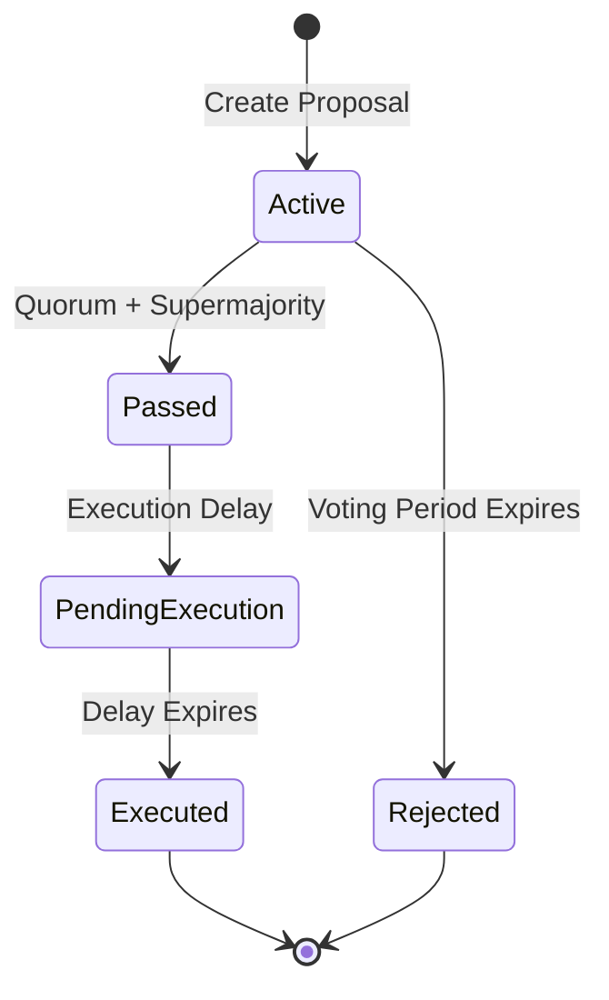

# Council of 21 Governance

UltraDAG's governance model separates technical consensus (validators, stake-weighted) from protocol governance (council, one-vote-per-seat). The Council of 21 governs protocol parameters without requiring any stake — seats are earned through expertise and community trust.

---

## Design Philosophy

Traditional blockchain governance suffers from plutocratic capture: whoever holds the most tokens controls the protocol. UltraDAG deliberately separates these concerns:

- **Validators** secure the network through staking and produce DAG vertices
- **The Council** governs protocol parameters through expertise-based seats
- **1-vote-per-seat** prevents wealth concentration in governance

!!! info "No stake requirement"
    Council members do not need to hold or stake any UDAG to participate in governance. Seats are granted through DAO proposals and represent expertise, not financial investment.

---

## Council Structure

The Council has **21 seats** divided across six categories:

| Category | Seats | Purpose |
|----------|-------|---------|
| Technical | 7 | Protocol development, security research, cryptography |
| Business | 4 | Partnerships, ecosystem growth, market strategy |
| Legal | 3 | Regulatory compliance, legal framework |
| Academic | 3 | Research, peer review, formal methods |
| Community | 2 | User advocacy, documentation, outreach |
| Foundation | 2 | Treasury oversight, organizational management |
| **Total** | **21** | |

Each category has a **fixed maximum** enforced by the protocol. A `CouncilMembership` proposal to add a Technical member will be rejected if all 7 Technical seats are already occupied.

---

## Voting Mechanics

### Equal Governance Weight

Every council member has exactly **1 vote**, regardless of category, tenure, or any UDAG holdings:

$$
\text{vote\_weight}(\text{member}) = 1
$$

This contrasts with stake-weighted governance where a single whale can override the entire community.

### Proposal Lifecycle



1. **Creation**: a council member submits a proposal (requires `MIN_FEE_SATS` fee)
2. **Active**: voting is open for the configured voting period
3. **Passed/Rejected**: determined by quorum and supermajority thresholds
4. **Execution delay**: passed proposals wait before taking effect
5. **Executed**: parameter changes are applied to the protocol

### Voting Parameters

| Parameter | Default | Governable Range |
|-----------|---------|------------------|
| Quorum | 10% of council seats | 5-100% |
| Supermajority | 66% of votes cast | 51-100% |
| Voting period | 120,960 rounds (~3.5 days) | 1,000-1,000,000 rounds |
| Execution delay | 2,016 rounds (~2.8 hours) | 100-100,000 rounds |
| Max active proposals | 20 | 1-100 |

!!! note "Snapshot quorum"
    The quorum denominator is **snapshotted at proposal creation time**. This prevents manipulation where council members vote and then resign to lower the quorum threshold.

---

## Proposal Types

### TextProposal

Non-binding signals. Used for community sentiment, roadmap discussions, and coordination:

```json
{
  "proposal_type": "Text",
  "title": "Increase bootstrap node diversity",
  "description": "Proposal to add bootstrap nodes in APAC and LATAM regions..."
}
```

TextProposals execute immediately after the delay period with no protocol effect.

### ParameterChange

Modifies a governable protocol parameter:

```json
{
  "proposal_type": "ParameterChange",
  "title": "Reduce minimum fee from 10,000 to 5,000 sats",
  "description": "Lower fees to encourage micropayment adoption...",
  "param_name": "min_fee_sats",
  "param_value": 5000
}
```

!!! warning "DAO activation gate"
    ParameterChange proposals require at least **8 active validators** (`MIN_DAO_VALIDATORS`) to execute. Below this threshold, passed proposals remain in `PendingExecution` (hibernation) until the validator count recovers. This prevents a small group from modifying protocol parameters before the network is sufficiently decentralized.

### CouncilMembership

Add or remove council members:

```json
{
  "proposal_type": "CouncilMembership",
  "title": "Add Jane Doe as Technical council member",
  "description": "Jane is a leading cryptographer with 15 years of experience...",
  "action": "Add",
  "address": "a1b2c3d4...",
  "category": "Technical"
}
```

Only existing council members can propose and vote on membership changes. Category seat limits are enforced.

---

## Governable Parameters

The following 10 parameters can be modified via `ParameterChange` proposals:

| Parameter | Default | Min | Max | Description |
|-----------|---------|-----|-----|-------------|
| `min_fee_sats` | 10,000 | 1 | 100,000,000 | Minimum transaction fee |
| `min_stake_to_propose` | 50,000 UDAG | 0 | 1,000,000 UDAG | Minimum stake for proposal creation |
| `quorum_numerator` | 10 | 5 | 100 | Quorum percentage |
| `approval_numerator` | 66 | 51 | 100 | Supermajority percentage |
| `voting_period_rounds` | 120,960 | 1,000 | 1,000,000 | Voting period length |
| `execution_delay_rounds` | 2,016 | 100 | 100,000 | Delay before execution |
| `max_active_proposals` | 20 | 1 | 100 | Concurrent proposal limit |
| `observer_reward_percent` | 20 | 0 | 100 | Passive staking reward rate |
| `council_emission_percent` | 10 | 0 | 30 | Council's share of emission |
| `slash_percent` | 50 | 10 | 100 | Equivocation slash severity |

!!! danger "Parameter change safety"
    All parameters have enforced minimum and maximum bounds. Even a compromised council cannot set fees to `u64::MAX` or slash percentages to 0%.

---

## Council Emission Rewards

Council members receive a share of each round's block reward:

$$
\text{council\_pool} = \text{round\_reward} \times \frac{\text{council\_emission\_percent}}{100}
$$

The pool is distributed **equally** among occupied council seats:

$$
\text{member\_reward} = \frac{\text{council\_pool}}{\text{occupied\_seats}}
$$

At default settings (10% council emission, 1 UDAG round reward, 21 seats):

$$
\text{member\_reward} = \frac{0.1 \text{ UDAG}}{21} \approx 0.00476 \text{ UDAG/round}
$$

This provides economic compensation for governance participation without requiring council members to hold or stake tokens.

---

## DAO Activation Gate

The DAO activation mechanism prevents premature parameter changes:

| Condition | Behavior |
|-----------|----------|
| Active validators >= 8 | DAO is active, ParameterChange proposals execute normally |
| Active validators < 8 | DAO is hibernating, ParameterChange proposals stay in `PendingExecution` |
| TextProposals | Always execute regardless of validator count |
| CouncilMembership | Always execute regardless of validator count |

!!! tip "Self-healing"
    The DAO automatically **reactivates** when the validator count recovers above the threshold. Hibernated proposals execute once conditions are met. Conversely, if validators drop out, the DAO automatically **hibernates** — no manual intervention required.

---

## Empty Council Safety

If all council members are removed (all 21 seats vacant):

- `snapshot_total_stake = 0` at proposal creation
- `has_passed_with_params()` returns `false` when total stake is 0
- No proposals can pass — the council is effectively locked

This prevents a scenario where an attacker removes all members and then self-nominates with no oversight.

---

## RPC Endpoints

| Endpoint | Method | Description |
|----------|--------|-------------|
| `/proposal` | POST | Create a new governance proposal |
| `/vote` | POST | Vote on an active proposal |
| `/proposals` | GET | List all proposals (max 200, newest first) |
| `/proposal/:id` | GET | Get proposal details including voter breakdown |
| `/vote/:id/:address` | GET | Check vote status for an address on a proposal |
| `/governance/config` | GET | View current governance parameters |

### Example: View Current Config

```bash
curl http://localhost:10333/governance/config
```

```json
{
  "min_fee_sats": 10000,
  "min_stake_to_propose": 5000000000000,
  "quorum_numerator": 10,
  "approval_numerator": 66,
  "voting_period_rounds": 120960,
  "execution_delay_rounds": 2016,
  "max_active_proposals": 20,
  "observer_reward_percent": 20,
  "council_emission_percent": 10,
  "slash_percent": 50
}
```

---

## Next Steps

- [Supply & Emission](supply.md) — how council emission fits into the supply schedule
- [Staking & Delegation](staking.md) — validator economics
- [Security Model](../security/model.md) — governance attack mitigations
