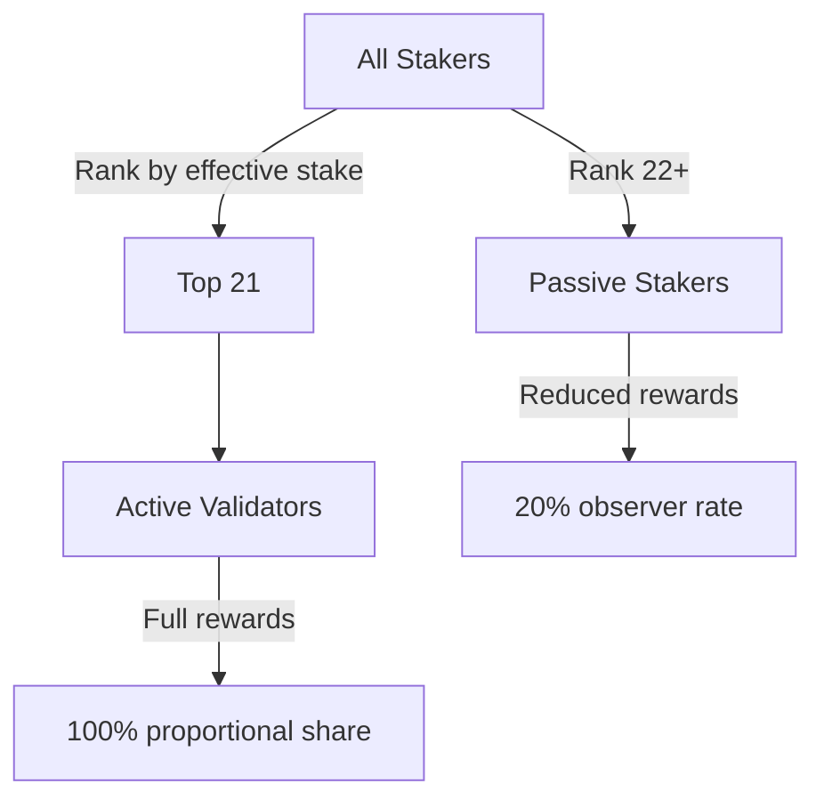

# Staking & Delegation

UltraDAG uses a proof-of-stake system with delegated staking. Validators stake UDAG to participate in consensus and earn rewards. Token holders can delegate to validators without running a node.

---

## Staking Overview

| Parameter | Value |
|-----------|-------|
| Minimum validator stake | 10,000 UDAG |
| Maximum active validators | 21 |
| Epoch length | 210,000 rounds (~12.15 days) |
| Minimum delegation | 100 UDAG |
| Unstake/Undelegate cooldown | 2,016 rounds (~2.8 hours) |
| Default commission | 10% |
| Commission range | 0-100% |

---

## Validator Staking

### Becoming a Validator

To become a validator:

1. Acquire at least **10,000 UDAG**
2. Submit a `Stake` transaction
3. If your effective stake ranks in the top 21 at the next epoch boundary, you become an active validator

```bash
curl -X POST http://localhost:10333/stake \
  -H "Content-Type: application/json" \
  -d '{
    "from": "YOUR_ADDRESS",
    "amount": 1000000000000,
    "private_key": "YOUR_PRIVATE_KEY"
  }'
```

!!! note "Fee-exempt"
    Staking operations (Stake, Unstake, Delegate, Undelegate, SetCommission) are **zero-fee** transactions. You do not need extra UDAG beyond the stake amount.

### Active Validator Set

The active validator set is determined at each **epoch boundary** (every 210,000 rounds):

1. All staked addresses are ranked by **effective stake** (own stake + delegations)
2. The top 21 become active validators for the next epoch
3. Ties are broken by address hash (deterministic)



### Effective Stake

A validator's effective stake determines their ranking and reward share:

$$
\text{effective\_stake} = \text{own\_stake} + \sum_{d \in \text{delegators}} d.\text{amount}
$$

Attracting delegations is a key strategy for validators to enter and remain in the active set.

---

## Reward Distribution

### Active Validator Rewards

Active validators earn rewards proportional to their effective stake. Each round:

$$
\text{validator\_pool} = \text{round\_reward} \times (1 - \text{council\_share\_pct})
$$

$$
\text{reward}_i = \text{validator\_pool} \times \frac{\text{effective\_stake}_i}{\sum_{j \in \text{active}} \text{effective\_stake}_j}
$$

**Example:** With 4 active validators and a 1 UDAG round reward (10% to council):

| Validator | Effective Stake | Share | Reward |
|-----------|----------------|-------|--------|
| Alice | 50,000 UDAG | 50% | 0.450 UDAG |
| Bob | 25,000 UDAG | 25% | 0.225 UDAG |
| Carol | 15,000 UDAG | 15% | 0.135 UDAG |
| Dave | 10,000 UDAG | 10% | 0.090 UDAG |
| **Total** | **100,000 UDAG** | **100%** | **0.900 UDAG** |

The remaining 0.100 UDAG goes to the Council.

### Passive Staking Rewards

Validators who are staked but **not in the top 21** still earn rewards at a reduced rate:

$$
\text{passive\_reward}_i = \text{active\_equivalent}_i \times 0.20
$$

This incentivizes staking even when not in the active set — passive stakers earn 20% of what they would earn as an active validator with the same stake.

!!! tip "Why passive rewards?"
    Passive staking rewards encourage a deep bench of validators ready to enter the active set. Without passive rewards, there would be no incentive to stake until you could guarantee a top-21 position, creating a barrier to entry.

---

## Delegation

### How Delegation Works

Token holders who don't want to run a validator can **delegate** their UDAG to an existing validator:

1. Delegator sends a `Delegate` transaction specifying a target validator
2. Delegated UDAG moves from the delegator's liquid balance to a `DelegationAccount`
3. The delegated amount increases the validator's effective stake
4. The delegator earns a share of the validator's rewards, minus commission

```bash
curl -X POST http://localhost:10333/delegate \
  -H "Content-Type: application/json" \
  -d '{
    "from": "DELEGATOR_ADDRESS",
    "validator": "VALIDATOR_ADDRESS",
    "amount": 10000000000,
    "private_key": "DELEGATOR_PRIVATE_KEY"
  }'
```

### Delegation Parameters

| Parameter | Value |
|-----------|-------|
| Minimum delegation | 100 UDAG (10,000,000,000 sats) |
| Maximum delegations per address | Unlimited |
| Delegation to multiple validators | Supported |
| Re-delegation | Undelegate + Delegate (cooldown applies) |

### Commission

Validators set a commission rate that determines their cut of delegation rewards:

$$
\text{delegator\_pool} = \text{validator\_total\_reward} \times \frac{\text{delegated\_stake}}{\text{effective\_stake}}
$$

$$
\text{commission} = \text{delegator\_pool} \times \frac{\text{commission\_pct}}{100}
$$

$$
\text{delegator\_reward}_i = (\text{delegator\_pool} - \text{commission}) \times \frac{d_i.\text{amount}}{\text{total\_delegated}}
$$

**Example:** Validator with 10% commission, 60,000 effective stake (20,000 own + 40,000 delegated), earning 0.54 UDAG/round:

| Component | Calculation | Amount |
|-----------|------------|--------|
| Validator's own share | 0.54 * (20,000/60,000) | 0.180 UDAG |
| Delegator pool | 0.54 * (40,000/60,000) | 0.360 UDAG |
| Commission (10%) | 0.360 * 0.10 | 0.036 UDAG |
| Distributed to delegators | 0.360 - 0.036 | 0.324 UDAG |
| **Validator total** | 0.180 + 0.036 | **0.216 UDAG** |

### Setting Commission

```bash
curl -X POST http://localhost:10333/set-commission \
  -H "Content-Type: application/json" \
  -d '{
    "from": "VALIDATOR_ADDRESS",
    "commission_percent": 15,
    "private_key": "VALIDATOR_PRIVATE_KEY"
  }'
```

Commission changes take effect immediately. Delegators should monitor their validator's commission rate.

### Checking Delegations

View your delegation:

```bash
curl http://localhost:10333/delegation/DELEGATOR_ADDRESS
```

View a validator's delegators:

```bash
curl http://localhost:10333/validator/VALIDATOR_ADDRESS/delegators
```

---

## Unstaking and Undelegating

### Cooldown Period

Both unstaking and undelegating have a **2,016 round cooldown** (~2.8 hours at 5-second rounds):

1. Submit `Unstake` or `Undelegate` transaction
2. Funds enter cooldown state (`unlock_at_round` is set)
3. During cooldown: funds earn no rewards and cannot be transferred
4. After cooldown expires: funds automatically return to liquid balance

```bash
# Unstake
curl -X POST http://localhost:10333/unstake \
  -H "Content-Type: application/json" \
  -d '{
    "from": "VALIDATOR_ADDRESS",
    "amount": 500000000000,
    "private_key": "VALIDATOR_PRIVATE_KEY"
  }'

# Undelegate
curl -X POST http://localhost:10333/undelegate \
  -H "Content-Type: application/json" \
  -d '{
    "from": "DELEGATOR_ADDRESS",
    "validator": "VALIDATOR_ADDRESS",
    "amount": 5000000000,
    "private_key": "DELEGATOR_PRIVATE_KEY"
  }'
```

!!! warning "Partial unstake"
    If unstaking would reduce your stake below the 10,000 UDAG minimum, the unstake is rejected. You must unstake the full amount to exit the validator set.

---

## Slashing

### Equivocation Penalty

Validators who produce conflicting vertices in the same round are slashed:

| Parameter | Value |
|-----------|-------|
| Default slash percentage | 50% |
| Governable range | 10-100% |
| Slash destination | Burned (removed from total supply) |

### Cascade to Delegators

Slashing cascades proportionally to all delegators:

$$
\text{delegator\_slash}_i = d_i.\text{amount} \times \frac{\text{slash\_pct}}{100}
$$

**Example:** Validator with 50,000 total delegations slashed at 50%:

- Each delegator loses 50% of their delegation
- A delegator with 5,000 UDAG delegated loses 2,500 UDAG
- All slashed amounts are burned (deflationary)

!!! danger "Delegation risk"
    Delegating to a validator exposes you to slashing risk. Choose validators carefully based on their track record, infrastructure reliability, and operational practices. Diversifying delegations across multiple validators reduces risk.

### Slash Detection

Equivocation is detected automatically by any node that receives two different vertices from the same validator for the same round. The evidence is:

1. Gossiped to all peers
2. Included in a DAG vertex as equivocation evidence
3. Once finalized, deterministically triggers the slash
4. All honest nodes apply the identical slash — no voting or disputes

---

## Epoch System

| Parameter | Value |
|-----------|-------|
| Epoch length | 210,000 rounds |
| At 5-second rounds | ~12.15 days |
| Validator set recalculation | Once per epoch |

At each epoch boundary:

1. Rank all stakers by effective stake
2. Top 21 become active validators
3. Remaining stakers become passive (20% reward rate)
4. Cooldowns from the previous epoch are processed
5. Commission changes are reflected in new reward calculations

---

## Summary of Fee Exemptions

| Transaction Type | Fee |
|-----------------|-----|
| Transfer | MIN_FEE (10,000 sats) |
| Stake | **Free** |
| Unstake | **Free** |
| Delegate | **Free** |
| Undelegate | **Free** |
| SetCommission | **Free** |
| CreateProposal | MIN_FEE (10,000 sats) |
| Vote | MIN_FEE (10,000 sats) |

---

## Next Steps

- [Governance](governance.md) — Council of 21 governance system
- [Supply & Emission](supply.md) — emission schedule and halving
- [Validator Handbook](../operations/validator-handbook.md) — operational guide for validators
