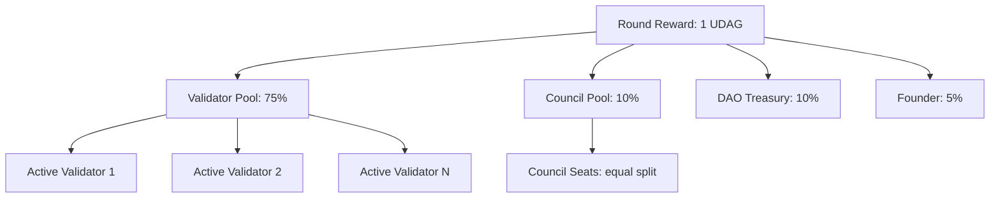

# Supply & Emission

UltraDAG has a fixed maximum supply of 21 million UDAG with a Bitcoin-style halving schedule. Zero pre-mine — all tokens distributed through per-round emission. This page covers the emission curve, distribution model, and supply enforcement.

---

## Maximum Supply

| Parameter | Value |
|-----------|-------|
| Max supply | 21,000,000 UDAG |
| Smallest unit | 1 sat = 0.00000001 UDAG |
| Sats per UDAG | 100,000,000 |
| Max supply in sats | 2,100,000,000,000,000 |

The maximum supply is a hard protocol constant — no governance proposal can increase it.

---

## Emission Schedule

### Block Reward

New UDAG is minted each round (not per vertex) according to a halving schedule:

| Era | Rounds | Reward per Round | Cumulative Emission |
|-----|--------|-----------------|-------------------|
| 1 | 0 — 10,499,999 | 1.00000000 UDAG | 10,500,000 UDAG |
| 2 | 10,500,000 — 20,999,999 | 0.50000000 UDAG | 15,750,000 UDAG |
| 3 | 21,000,000 — 31,499,999 | 0.25000000 UDAG | 18,375,000 UDAG |
| 4 | 31,500,000 — 41,999,999 | 0.12500000 UDAG | 19,687,500 UDAG |
| ... | ... | ... | ... |
| 64 | ... | < 1 sat | 21,000,000 UDAG |

### Halving Interval

$$
\text{halving\_interval} = 10{,}500{,}000 \text{ rounds}
$$

At 5-second rounds:

$$
10{,}500{,}000 \times 5\text{s} = 52{,}500{,}000\text{s} \approx 1.66 \text{ years}
$$

### Full Emission Timeline

The emission curve follows a geometric series. Over 64 halvings (~106 years), the total minted supply asymptotically approaches 21,000,000 UDAG:

```
Era  1: +10,500,000.00 UDAG  (50.00% of max)
Era  2:  +5,250,000.00 UDAG  (75.00% of max)
Era  3:  +2,625,000.00 UDAG  (87.50% of max)
Era  4:  +1,312,500.00 UDAG  (93.75% of max)
Era  5:    +656,250.00 UDAG  (96.88% of max)
...
Era 64:          < 1 sat      (100.00% of max)
```

!!! info "Reward precision"
    When the halved reward drops below 1 sat (the smallest representable unit), the reward becomes 0 and emission stops permanently. This occurs after approximately 64 halvings.

---

## Emission-Only Genesis (Zero Pre-Mine)

**No genesis allocations.** Total supply starts at 0 on mainnet. Every UDAG enters circulation through per-round protocol emission:

| Recipient | Share | Mechanism |
|-----------|-------|-----------|
| Validators & Stakers | 75% | Proportional to effective stake (own + delegated) |
| DAO Treasury | 10% | Governed by Council proposals (TreasurySpend) |
| Council of 21 | 10% | Equal split among seated council members |
| Founder | 5% | Protocol development, earned through emission |

!!! note "Testnet faucet"
    Testnet builds include a 1,000,000 UDAG faucet reserve for testing. This is feature-gated and excluded from mainnet genesis. On mainnet, all participants (founder, treasury, council) start at 0 and earn through emission.

---

## Reward Distribution

Each round, newly minted UDAG is distributed as follows:

### Distribution Flow



### Validator Rewards

The validator pool (75% of round reward) is distributed to validators:

- **Active validators** (producing vertices): receive rewards proportional to effective stake
- **Passive stakers** (staked but not in top 100): receive 50% of what an equivalent active validator would earn

$$
\text{validator\_reward}_i = \text{round\_reward} \times (1 - \frac{\text{council\_emission\_percent}}{100}) \times \frac{\text{effective\_stake}_i}{\sum \text{effective\_stakes}}
$$

### Council Rewards

10% of the round reward (default, governable 0-30%) goes to the Council of 21:

$$
\text{council\_share} = \text{round\_reward} \times 0.1
$$

This is distributed equally among occupied council seats.

---

## Per-Round Protocol Distribution

!!! warning "Per-round, not per-vertex"
    Rewards are minted **once per finalized round**, not once per vertex. In a round with multiple finalized vertices from different validators, the protocol mints exactly one round reward. This prevents inflation variance based on the number of vertices produced.

The distribution sequence each round:

1. Calculate the current era's reward: `reward = initial_reward >> (round / halving_interval)`
2. Cap at remaining supply: `reward = min(reward, MAX_SUPPLY - total_supply)`
3. Mint `reward` sats into existence (increment `total_supply`)
4. Distribute `(100 - council_emission_percent)%` to validator pool (proportional to effective stake)
5. Distribute `council_emission_percent%` to council pool (equal per seat)
6. Verify supply invariant

---

## Fee Handling

Transaction fees are **not** part of the emission — they come from existing circulating supply:

| Aspect | Behavior |
|--------|----------|
| Fee collection | Fees are collected from the transaction sender |
| Fee destination | Fees go to the vertex producer via deferred coinbase (collected from successful txs only) |
| Coinbase | Vertex coinbase contains collected fees only (no minted reward) |
| Fee-exempt operations | Stake, Unstake, Delegate, Undelegate, SetCommission |
| Minimum fee | 10,000 sats (0.0001 UDAG) for non-exempt transactions |

Minted rewards are distributed separately via `distribute_round_rewards()`. Fees are included in the vertex producer's coinbase independently.

---

## Supply Cap Enforcement

The protocol enforces the supply cap at multiple levels:

### Minting Cap

```rust
let reward = base_reward >> (current_round / HALVING_INTERVAL);
let capped = std::cmp::min(reward, MAX_SUPPLY_SATS - total_supply);
```

If `total_supply` equals `MAX_SUPPLY_SATS`, no new UDAG is minted. The protocol continues operating on fees only.

### Supply Invariant

After every state transition:

$$
\text{liquid} + \text{staked} + \text{delegated} + \text{treasury} = \text{total\_supply} \leq \text{MAX\_SUPPLY}
$$

Violation triggers immediate node halt (exit code 101).

### Slashing is Deflationary

When a validator is slashed for equivocation, the slashed amount is **burned** — removed from `total_supply`. This makes slashing deflationary:

$$
\text{total\_supply}_{\text{new}} = \text{total\_supply}_{\text{old}} - \text{slashed\_amount}
$$

Burned supply can never be re-minted. The effective max supply decreases permanently with each slash event.

---

## Comparison with Bitcoin

| Property | UltraDAG | Bitcoin |
|----------|----------|--------|
| Max supply | 21,000,000 | 21,000,000 |
| Smallest unit | sat (10^-8) | sat (10^-8) |
| Halving interval | 10,500,000 rounds (~1.66 yr) | 210,000 blocks (~4 yr) |
| Initial reward | 1 UDAG/round | 50 BTC/block |
| Full emission | ~106 years | ~140 years |
| Deflation mechanism | Slashing burns | Lost coins |
| Fee model | Min fee + exempt staking ops | Market-driven fees |

---

## Next Steps

- [Staking & Delegation](staking.md) — how rewards are earned
- [Governance](governance.md) — council reward allocation
- [State Engine](../architecture/state-engine.md) — supply invariant enforcement
